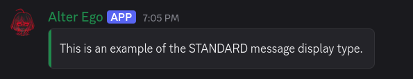
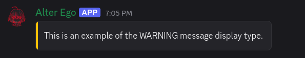
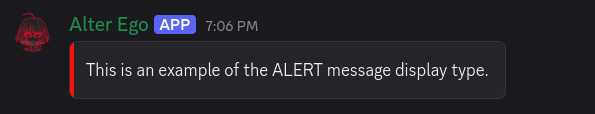
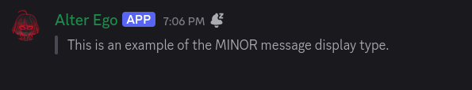
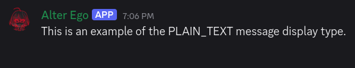
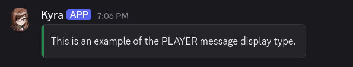
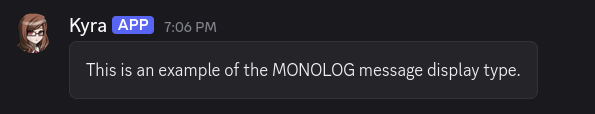

# Discord

**Discord** is a free voice and text chat program that's designed for gamers. Due to many of its features, Alter Ego was
designed specifically to use it via the [discord.js API](https://discord.js.org/#/).

## Features

Discord members congregate in _servers_. Servers may be publicly accessible or open only to members who are sent an
invite link to that server. Further, text and voice chat can take place in different _channels_ in a server. Within a
server, different members may be granted specific permissions. These permissions can be given to specific _roles_ or
assigned to members on a channel by channel basis. Permissions exist to give members the ability do several different
things, including:

* Create and delete channels.
* Grant and revoke permissions to specific members.
* Kick and ban members from the server.
* Change a member's nickname within the server.
* See a channel on the channel list and read messages within it.
* Delete and pin messages within a channel.
* Read the message history of a channel.
* And many more.

In every channel, a member list is displayed on the right-hand side which displays all of the members that can read that
channel. Members can be in a server without having a Discord account using the Discord browser app, however these
members will cease to exist after they exit the app. With a Discord account, members can be in a server indefinitely,
even when they're offline.

Discord members can also direct message each other outside of a server. They can create group DMs as well.

## Gameplay Implementation

This section lists how Discord is used to facilitate the game.

A game is contained in one and only one Discord server. It is run by Alter Ego.

Every [Player](../reference/data_structures/player.md) is represented by
a [Discord server member](https://discord.js.org/docs/packages/discord.js/14.25.1/GuildMember:Class). Each Player must have
their own Discord account. A single account cannot be used for multiple Players.

Every [Room](../reference/data_structures/room.md) is represented by
a [Discord text channel](https://discord.js.org/docs/packages/discord.js/14.25.1/TextChannel:Class). When a Player moves to
a given Room, they will be granted permission to read that channel, and their permission to read the channel of the Room
they were previously in will be revoked. This creates the effect of only being in one Room at a time. In a Room, a
Player can see all of the other Players that are in the Room on the user list on the right side of the screen. Messages
sent by a Player to a Room channel act as dialogue from that Player, enabling communication between Players in a Room.

Every [Whisper](../reference/data_structures/whisper.md) is also represented by a Discord text channel. When a Whisper
is created between two or more Players, a new channel will be created in the Whisper category, and only the Players in
the Whisper will be granted read access to that channel. When a Player leaves the Room or is otherwise removed from the
Room's channel, their read access to all Whispers they were in will be revoked. Their name will also be removed from the
Whisper name, whose channel name will be edited accordingly. When all Players in a Whisper leave the Room, the Whisper
channel will either be archived or immediately deleted, depending on the
[autoDeleteWhisperChannels setting](../reference/settings.md#auto_delete_whisper_channels).

Every [spectate channel](../reference/data_structures/player.md#spectate-channel) also has a Discord text channel. When
Player data is loaded from the spreadsheet, Alter Ego will check to see if that Player already has a spectate channel in
the Spectator category. If not, it will create one with that Player's name. It will not do this if there are already 50
spectate channels in the category.

When a Player enters a Room, inspects a [Fixture](../reference/data_structures/fixture.md) or
[Room Item](../reference/data_structures/room_item.md), or otherwise does something that requires text from
the [Spreadsheet](../reference/data_structures/index.md) be sent, Alter Ego will send the text to that Player via DM.
Any [Narration](../reference/data_structures/narration.md) regarding a Player action will generally be sent to the
channel of the Room that Player is in.

## Displaying Content

Discord offers many ways to display content. Alter Ego makes use of several of these.

### Markdown

Discord has its own implementation of
[Markdown](https://support.discord.com/hc/en-us/articles/210298617-Markdown-Text-101-Chat-Formatting-Bold-Italic-Underline).
This allows users to style text in various ways. Alter Ego interacts with Discord Markdown in the following ways:

- When a Player sends a message to a Room channel as a Header of any size, Alter Ego considers this to be shouted
  dialog, and communicates it to neighboring Rooms.
- When a Player sends a message to a Room channel as Subtext, Alter Ego considers this to be quiet dialog, and will not
  communicate it to neighboring Rooms, even if it is in all uppercase letters.

### Display Components

Discord has a variety of [Display Components](https://discordjs.guide/legacy/popular-topics/display-components), which
allow bots to send messages with highly customizable appearances.

Alter Ego has its own system of message display types. These are pre-defined sets of Display Components that can be sent
by Alter Ego with ease. They are detailed here.

#### STANDARD

The `STANDARD` message display type is used in standard [Narrations](../reference/data_structures/narration.md). It
consists of text inside of a [Container Component](https://docs.discord.com/developers/components/reference#container).
The accent color used is set by the
[`STANDARD_MESSAGE_DISPLAY_ACCENT_COLOR` setting](../reference/settings.md#standard_message_display_accent_color).

#### WARNING

The `WARNING` message display type is used in Narrations meant to warn Players. It
consists of text inside of a Container Component. The accent color used is set by the
[`WARNING_MESSAGE_DISPLAY_ACCENT_COLOR` setting](../reference/settings.md#warning_message_display_accent_color).

#### ALERT

The `ALERT` message display type is used in Narrations meant to convey a sense of danger or urgency. It
consists of text inside of a Container Component. The accent color used is set by the
[`ALERT_MESSAGE_DISPLAY_ACCENT_COLOR` setting](../reference/settings.md#alert_message_display_accent_color).

#### MINOR

The `MINOR` message display type is used in Narrations meant to communicate information that isn't important. It uses
Markdown, consisting of Subtext in a Block Quote. Messages sent with the `MINOR` message display type are sent with the
[`SUPPRESS_NOTIFICATIONS` Flag](https://docs.discord.com/developers/resources/message#message-object-message-flags),
so that they will not trigger a notification for users.

#### PLAIN_TEXT

The `PLAIN_TEXT` message display type is used to send a message as plain text, with no Display Components.

#### PLAYER

The `PLAYER` message display type is used to send Narrations on behalf of a Player. They are used when a Player performs
a [Gesture](../reference/data_structures/gesture.md) or sends a Narration with the
[narrate](../reference/commands/player_commands.md#narrate) [command](../reference/commands/moderator_commands.md#narrate).
It consists of a [Webhook message](https://support.discord.com/hc/en-us/articles/228383668-Intro-to-Webhooks)
in which the username is the Player's [display name](../reference/data_structures/player.md#display-name), and the
avatar is their current [display icon](../reference/data_structures/player.md#display-icon) or Discord avatar. The
content of the Narration consists of text inside of a Container Component. It uses the same accent color as a
message sent with the `STANDARD` message display type.

#### MONOLOG

The `MONOLOG` message display type is used to send [Monologs](../reference/data_structures/action.md#monolog-action) on
behalf of a Player. It consists of a Webhook message that functions identically to the `PLAYER` message display type.
However, the Container Component does not have an accent color.

### Interactive Components

> [!CAUTION]
> TODO

## Limitations

Discord servers have a number of limits. The following limitations are relevant to Alter Ego and the game:

* A server can have _at most_ **500 channels** - text, voice, and categories combined. Once 500 channels are reached, no
  more channels can be created.
    * Because each Room is represented by its own channel, and because there are 10 channels (including categories)
      minimum that Alter Ego requires outside of Room and Whisper channels, a single game can have _at most_ about **440
      Rooms**. This number would consist of 8 categories for Rooms, each containing 50 channels, as well as a 9th
      category containing only 31 channels. This number does not account for spectate channels. Theoretically, a single
      game could have up to **491 Rooms**, but only if Whispers are disabled, no Players have spectate channels, and the
      Whisper and Spectator categories are deleted.
* A channel category can have _at most_ **50 channels** - text and voice combined. Once 50 channels are reached, no more
  channels can be created in the category.
    * If a game has more than 50 Rooms, additional Room categories will have to be created.
* Message limit: **2,000 characters**. Nitro users have a message limit of **4,000** characters. (note:
  user/channel/role mentions and emojis contain more characters than are shown)
    * If a description (without formatting characters) is longer than 2,000 characters, Alter Ego will not be able to
      send it to a Player.
    * If a Player with Discord Nitro sends a message in a Room or Whisper channel that is longer than 2,000 characters,
      it will not be sent to spectate channels. Players should be discouraged from doing this.
* Username/nickname: **32 characters**.
    * A Player's name must be 32 characters or fewer.

Another limit involves the **Read Message History** permission. When a member doesn't have this permission (which is
recommended for gameplay purposes), they will not be able to see messages sent any time they didn't have permission
to read a channel during their current Discord session. A Discord session can loosely be defined as the period of time
starting when a member opens the Discord application and ending when they close it. This can mean different things
depending on what version of the Discord application the user is using:

* On the Discord desktop app, a session ends when the user logs out, closes the app, refreshes the app, puts their
  computer into sleep mode, or turns off their computer.
* On the Discord browser app, a session ends when the user logs out, closes the tab, refreshes the page, closes their
  browser, or puts their computer into sleep mode.
* On the Discord mobile app, a session ends when the user logs out, closes the app, locks their device, or turns off
  their device. The session may also end when the user switches to a different app, though this depends on what
  operating system the device uses and how long the Discord app is inactive.

When a session ends, all messages that a user without the Read Message History permission was previously able to read
will disappear when the user opens Discord again. For this reason, the Discord desktop app provides the best experience
when playing the game because it most easily retains a session. The Discord browser app also works somewhat well for
this purpose. However, using the Discord mobile app to play is _severely_ not recommended. Unless the user keeps the
app open constantly, never switches to another app, and never locks their device, a continuous session cannot be
guaranteed, and thus the message history they have access to will clear _very_ frequently. If you would like to see
this issue resolved, [upvote this thread in the Discord Feedback forums](https://support.discordapp.com/hc/en-us/community/posts/360046946331-Change-read-message-history-permission).

## Known bugs

* Occasionally, when a Player moves to a new Room, the member list for that Room will appear blank. This can usually be
  fixed by the user opening a channel in a different category and then opening the Room channel again.
* Occasionally, when a Player leaves a Room, their read permission for all of the Whispers they were in will not be
  revoked. Additionally, the channel name may not be updated.
