# Node Installation

> [!NOTE]
> These instructions are for installing Alter Ego for use with Node.js. Unless you are planning to work on the
> source code as a developer, doing this is not recommended. It is much easier to install and run Alter Ego
> using Docker. For the Docker installation instructions, [see this page](../../moderator_guide/installation.md).

Installation of Alter Ego is rather complicated. In order to create an environment in which Alter Ego can facilitate a
game, many steps need to be taken. This page will explain them in detail.

> [!CAUTION]
> Do not host Alter Ego for anyone you don't trust. For more information on why you shouldn't,
> see the warning for [Flag value scripts](../../reference/data_structures/flag.md#value-script).

## Step 1: Download Alter Ego

First, you need to download Alter Ego itself. If you already have Git, you can clone the repository by entering
`git clone https://github.com/MsVBLANK/Alter-Ego.git` in Git. If not, you can simply download the ZIP file to your
computer.


Downloading Alter Ego as a ZIP file is not recommended however, as that makes it harder to keep your copy of Alter Ego
up to date. If you do not already have Git, [install the official GitHub Desktop app](https://desktop.github.com/), and
then click File > Clone Repository, then navigate to the URL tab and paste the Alter Ego repository link like so:

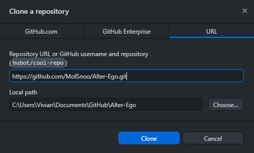

If you've done it this way, then you can update Alter Ego by clicking the **Pull origin** button in the GitHub Desktop
app.

### Switch to a numbered version

If you do not wish to use the latest changes on on the `master` branch,
you have to run additional commands to sync to a numbered version.

#### With Git

Alter Ego versions are organized in "tags", therefore you must switch to a tag in git to stay on a numbered version. In
a terminal, run.

```
git fetch --all --tags
git checkout [VERSION]
```

Where `VERSION` is the version of Alter Ego you wish to use (e.g. `2.0.0`).

#### Without Git

Go to the Alter Ego GitHub page and download the latest release. Click the releases box and select the latest one.

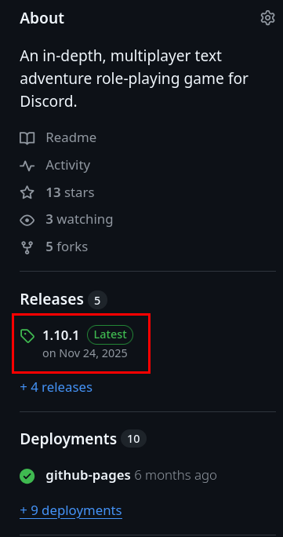

There, you will see something like this.

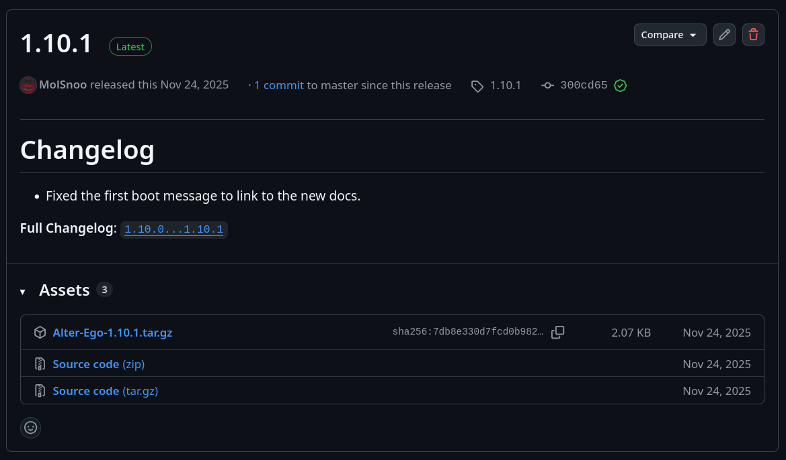

Download the source code archive `Source code (zip)`. Use your favorite archive utility to open the archive (e.g. 7zip,
GNOME Archive Manager, PeaZip), and extract the contents into your folder of choice.

## Step 2: Install Node.js with nvm

Alter Ego runs on, Node.js a JavaScript runtime environment. Without installing it to your computer, you won't be able
to run Alter Ego.

To make installing Node.js simpler, we recommend using nvm (Node Version Manager). Nvm helps you match your node version
with the project's version and allows you to use different versions of Node.js on different projects.

To install nvm, follow the instructions on the [nvm GitHub page](https://github.com/nvm-sh/nvm#installing-and-updating).

After installing nvm, open a terminal set to the project directory and run:

```sh
nvm install
```

This will install the Node.js version used by Alter Ego.

## Step 3: Install dependencies

Alter Ego requires a few dependencies in order to run properly. These are things like
the [Discord](../../reference/discord.md) and the Google Sheets API which allow it to facilitate a game.

First, open a terminal, and navigate to your Alter Ego folder, like so:


Now that you're in the directory of Alter Ego, run this command: `npm ci`. This will automatically install all of
the required dependencies.

## Step 4: Create a Discord bot

Now that you have Alter Ego installed, you'll need to create a new Discord bot to bind its functionality to. Navigate
to [the Discord Developer Portal](https://discord.com/developers/applications), and once you log in to your Discord
account, create a new application. You can call it whatever you like. This example will use an application called
"Alter Ego", but you can call it whatever you want. Once you create the application, you'll be taken to a page
that looks like this:

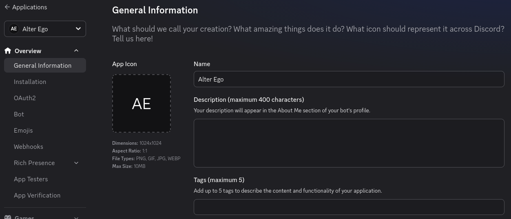

You can ignore this for now. Navigate to the **Installation** tab on the left-hand side. This will bring you to this page:

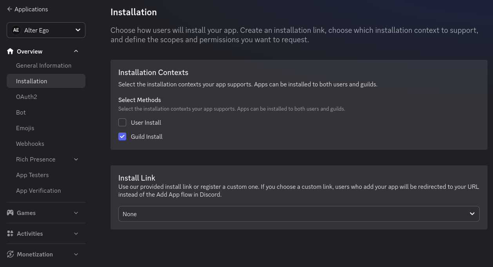

Under "Installation Contexts", _uncheck_ "User Install", and make sure "Guild Install" is _checked_.
In the dropdown under "Install Link", select "None". You don't want other people to be able to install your bot to
their servers, so there's no need to create a public installation URL.

Now navigate over to the **Bot** tab on the left-hand side. This will bring you to this page:

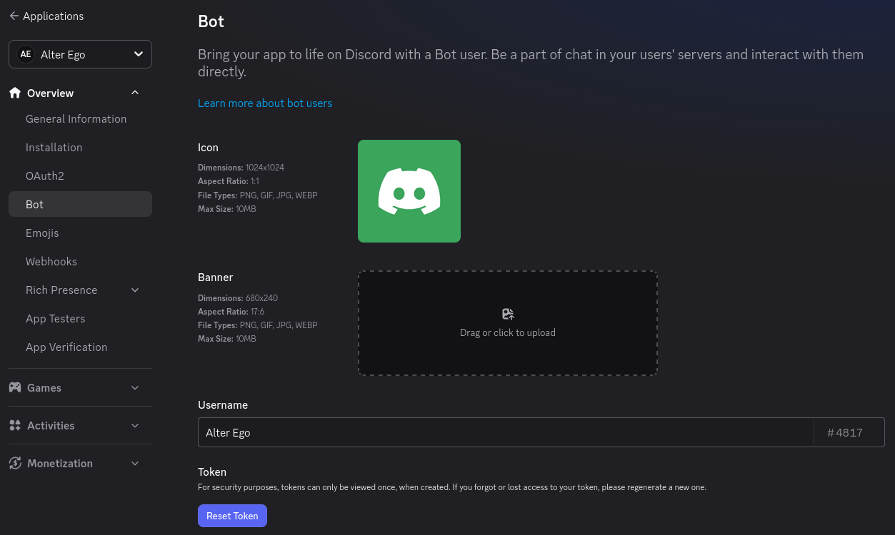

On this page, you can change the bot's name, set its profile picture, upload its banner image, and a few other things.
Take note of the "Reset Token" button; you'll need to press it later, but you can ignore it for now.

Scroll down a bit, and you'll find some settings. First, under "Authorization Flow":

- **Disable** the "Public Bot" setting.
    - Alter Ego can only be in one server, so this will prevent other people from inviting it to their servers.
- **Disable** the "Requires OAuth2 Code Grant" setting.

Next, you'll find more settings under "Privileged Gateway Intents":

- **Enable** the "Presence Intent" setting.
- **Enable** the "Server Members Intent" setting.
- **Enable** the "Message Content Intent" setting.

Without all of these set according to these instructions, Alter Ego will not function properly. If you've done
everything right, your settings will look like this:


## Step 5: Create a Discord server

Before you can get Alter Ego up and running, you'll have to create a Discord server. You can call it whatever you like,
but once it's made, you'll have to set a number of things up.

The easiest way to create a server is using [this template](https://discord.new/bAA3RcSQPNXj), which will add all of the
requisite roles and channels for you. If you want to set those up manually, refer
to [this page](channel_and_role_creation.md).

### Enable Developer Mode

You'll have to enable Developer Mode for your account for the next few steps. To do this, navigate to your User Settings
in Discord. Open the **Developer** tab near the very bottom. You'll see a switch labeled **Developer Mode**.
Turn it on if it's not already enabled.

## Step 6: Invite your bot to the server

Back on the Discord Developer Portal, click on the **OAuth2** tab on the left-hand side. Scroll down to the
"OAuth2 URL Generator" section:

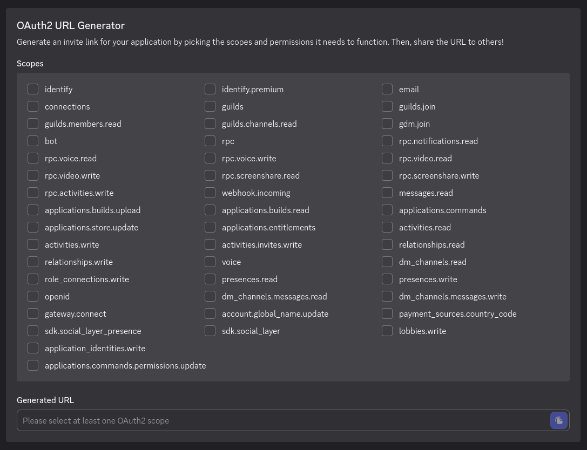

Under "Scopes", Check **bot**, then in the "Bot Permissions" section that appears below it, check **Administrator**.
You should have something that looks like this:

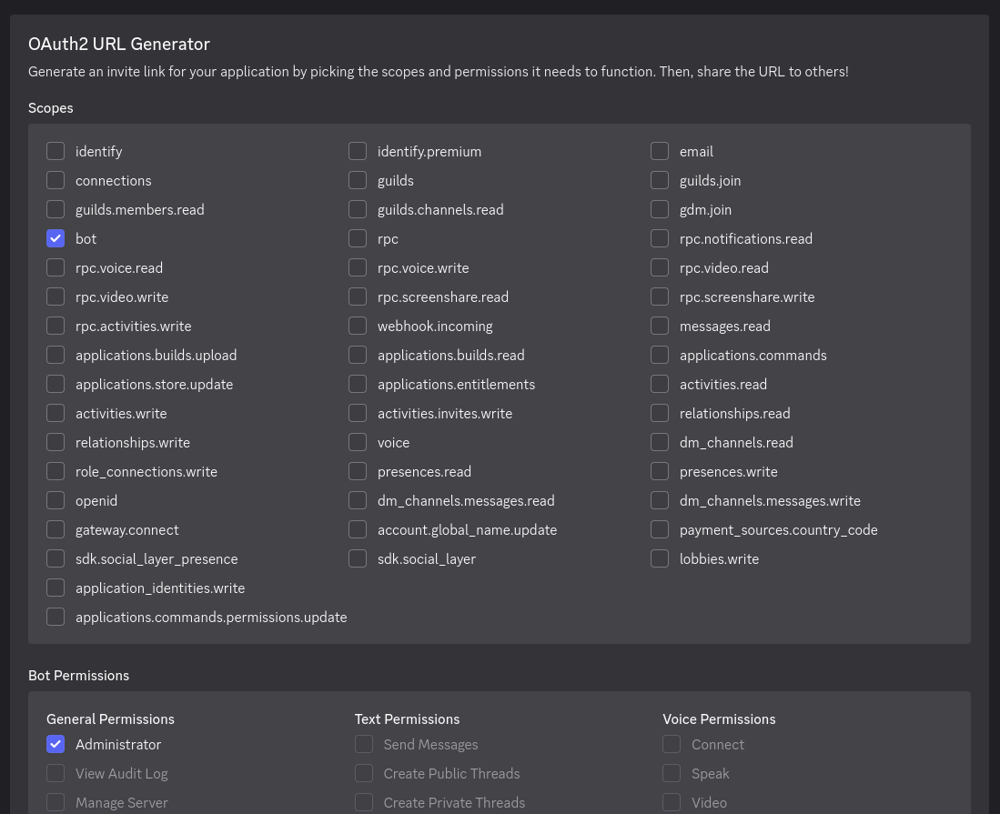

Finally, there will be two text boxes underneath the "Permissions" section:

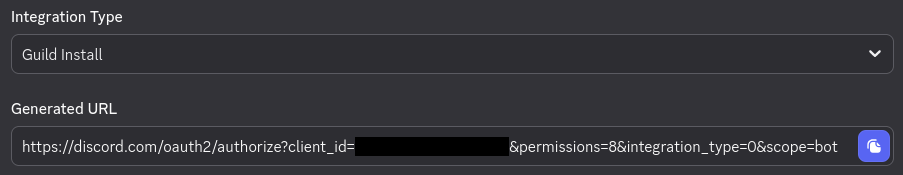

Under the "Integration Type", dropdown, select "Guild Install". Then, copy the URL in the "Generated URL" box,
send it to a Discord channel in the server you just made (ideally to a channel that only you have access to), and click
on it. It should display a menu that looks like this:

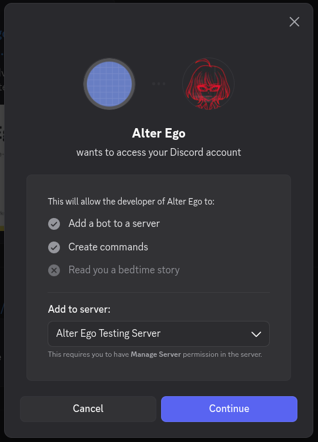

Make sure the server you just made is the one that's selected in the drop down, then click **Continue**.
Make sure **Administrator** is checked, and confirm by clicking **Authorize**.

With that, your bot will join your server! However, it doesn't do anything at the moment.
You still need to do a few things.

## Step 7: Create a spreadsheet

Next, you will need to create a spreadsheet for Alter Ego to use. For more information, see the article
on [spreadsheets](../../reference/data_structures/index.md).

## Step 8: Enable the Google Sheets API

In order for Alter Ego to work properly, you will need to create a new Google APIs project. The easiest way to do that
is to navigate to the [Enable Google Workspace APIs page](https://developers.google.com/workspace/guides/enable-apis)
and click the **Enable Sheets API** button near the bottom.

That should bring you to a page that looks like this:

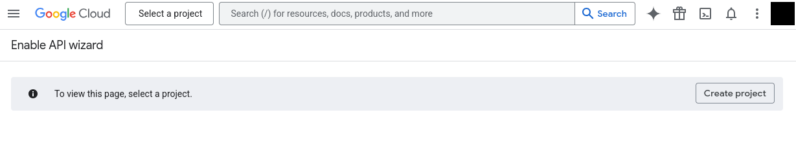

Create a project. You can call it anything you want. In the prompts that follow, confirm that you want to enable the
Google Sheets API. If you did it right, you'll be shown a message that says
"You have successfully enabled Google Sheets API."

## Step 9: Create a service account

In order to allow Alter Ego to read and write to the spreadsheet, you'll need to create a service account for it to use.
To do that, open the navigation menu in the top left corner and navigate to the **Credentials** tab under
**APIs & Services**, like so:

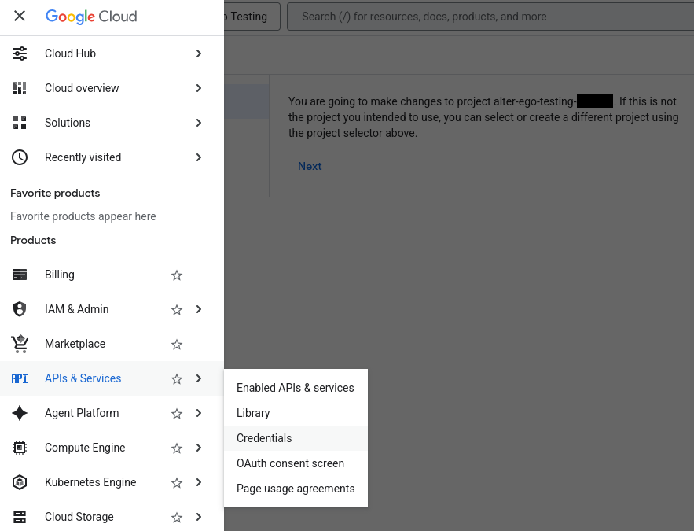

On the next page, click the link that says **Manage service accounts**:

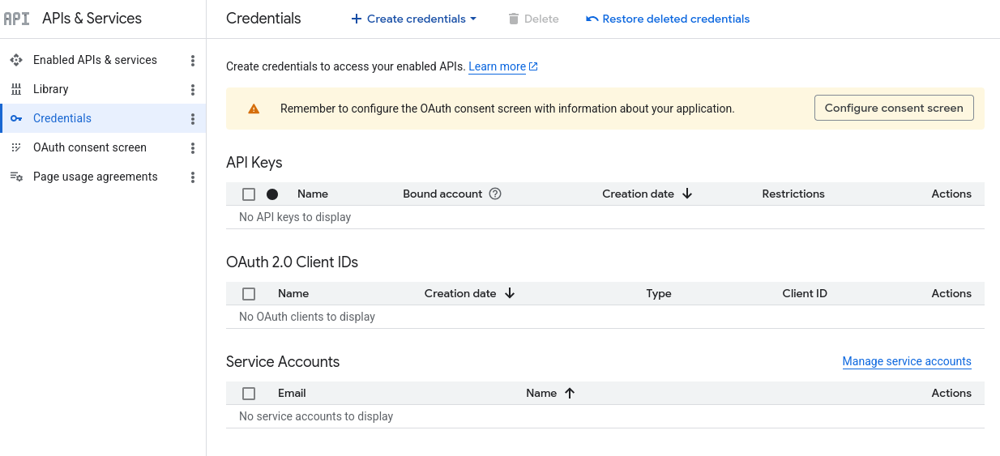

On the next page, click the **Create service account**. You should be brought to a page like this:

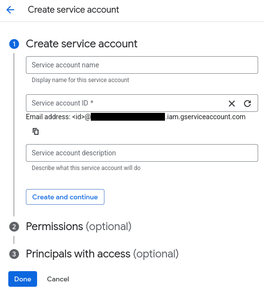

For the name, enter the bot's name; in this case, it's Alter Ego. You can set its ID if you want, or just accept the
one it generates. For the description, enter whatever you like. Click **Create and continue**.

In the Permissions menu, grant it the "Owner" role. You can skip step 3. Once you're done, you'll be returned to the
Service accounts page.

Once your service account is made, you should see it under the service accounts list. There will be a meatball menu
under the **Actions** column for it. Click on that, and select **Manage keys**. You'll be taken to this page:

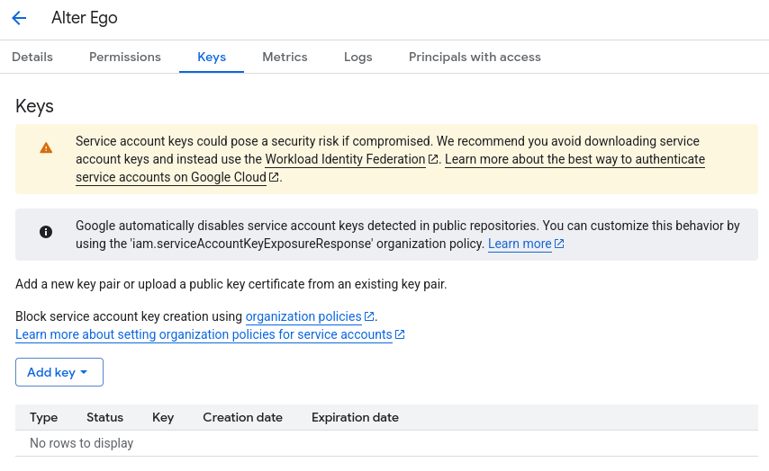

Click the **Add Key** button and select **Create new key**. Make sure the key type is **JSON**, then click **Create**.
This will download a file to your computer. Don't touch that just yet - there's one thing to do first. Return to the
**Service Accounts** page.

## Step 10: Share the spreadsheet

On the Service Accounts page, you should now see the service account you just created. Copy its email address, then head
over to the spreadsheet you made earlier.

On the spreadsheet, press the **Share** button. Paste the service account's email address into the dialog box and make
sure to give it permission to edit the spreadsheet. You can also do the same with any other moderators you have, if you
haven't done so already. Once you've done that, you nearly have everything you need.

> [!CAUTION]
> Do not grant write access to the spreadsheet to any users that you don't fully trust.

## Step 11: Edit .env file

The `.env` file is used to change all settings for Alter Ego. Before running Alter Ego, you must change several values
here.

First, open the `Alter-Ego` folder that you downloaded. Then, make a copy of `.env.example` and name it `.env` (note you
may have to set your file browser to show hidden files). On Linux, use these commands.

```shell
cd Alter-Ego
cp .env.example .env
```

Open the `.env` file in a text editor. You should see something like this:

```dotenv
# This is an example of an environment file for docker compose.
#
# '#' has been used to comment out any variables that do not need
# to be changed from default. Remove '#' to set them if you want
# to use something other than the default value.
#
# Environment variables should be enclosed in single quotes, and
# should follow the data type next to it (e.g. String).
# For instance: DEBUG_MODE='true'

# Time Zone
# See https://en.wikipedia.org/wiki/List_of_tz_database_time_zones
# for a complete list of timezones.
TZ='America/New_York'

# Credentials
DISCORD_TOKEN=                                # String. Token of discord bot
G_PROJECT_ID=                                 # String. Google project ID
G_PRIVATE_KEY_ID=                             # String. Google private key ID
G_PRIVATE_KEY=                                # String. Google private key
G_CLIENT_EMAIL=                               # String. Google client email
G_CLIENT_ID=                                  # String. Google client id
G_CLIENT_X509_CERT_URL=                       # String. Google cert url

# Settings
SPREADSHEET_ID=                               # String. ID of spreadsheet
...
(file continues on)
```

### Setting Time Zone

Before running Alter Ego, you should set the time zone for your container, so that events in the game sync up to your
location.

Edit the `TZ` line so that it matches the time zone where the game occurs in. For instance, if you want to set the
timezone to London, you would change the line to `TZ='Europe/London'`. For a complete list of timezones, refer to
this [Wikipedia article](https://en.wikipedia.org/wiki/List_of_tz_database_time_zones).

### Setting Credentials

Navigate back to the Discord Developer Portal once again and find the application you created earlier. Open the **Bot**
tab. Under **Token**, click **Reset Token**. You may be asked to authenticate with 2FA before proceeding. Once the token
has been created, click **Copy**. Paste it inside the single quotes after `DISCORD_TOKEN=` in your `.env` file.

> [!CAUTION]
> This token must not be shared with **anyone**, as it grants full access to your bot's account.

Next, open the file you downloaded after creating the service account in any text editor. The file should look something
like this:

```json
{
    "type": "service_account",
    "project_id": "(CONFIDENTIAL)",
    "private_key_id": "(CONFIDENTIAL)",
    "private_key": "(CONFIDENTIAL)",
    "client_email": "(CONFIDENTIAL)",
    "client_id": "(CONFIDENTIAL)",
    "auth_uri": "https://accounts.google.com/o/oauth2/auth",
    "token_uri": "https://oauth2.googleapis.com/token",
    "auth_provider_x509_cert_url": "https://www.googleapis.com/oauth2/v1/certs",
    "client_x509_cert_url": "(CONFIDENTIAL)",
    "universe_domain": "googleapis.com"
}
```

> [!CAUTION]
> **Almost all of the data in this file is confidential. Don't share it with a single person, and make absolutely sure
not to put it online somehow.**

Next, add the Google service account credentials to your `.env` file. Copy each corresponding value in the Google
credentials file into your `.env` file. For instance, copy `project_id` into `PROJECT_ID=`. Replace the double quotes in
the original file with single quotes. Don't worry about any values that aren't in the `.env` file, you won't need them.

If you did everything right, the credentials section should look like this:

```dotenv
...
# Credentials
DISCORD_TOKEN='(CONFIDENTIAL)'                      # String. Token of discord bot
G_PROJECT_ID='(CONFIDENTIAL)'                       # String. Google project ID
G_PRIVATE_KEY_ID='(CONFIDENTIAL)'                   # String. Google private key ID
G_PRIVATE_KEY='(CONFIDENTIAL)'                      # String. Google private key
G_CLIENT_EMAIL='(CONFIDENTIAL)'                     # String. Google client email
G_CLIENT_ID='(CONFIDENTIAL)'                        # String. Google client id
G_CLIENT_X509_CERT_URL='(CONFIDENTIAL)'             # String. Google cert url
...
```

### Setting Spreadsheet ID

Finally, you must set the spreadsheet ID. A Google Sheets URL contains two IDs. The first is the ID of the entire
spreadsheet itself. The second is the ID of the individual sheet currently open in the spreadsheet. You can retrieve the
ID of either by copying them from the URL. The format is as follows:

`https://docs.google.com/spreadsheets/d/(entire spreadsheet ID)/edit#gid=(individual sheet ID)`

Copy the ID for the entire spreadsheet and paste it in single quotes after `SPREADSHEET_ID=`. For instance.

```dotenv
SPREADSHEET_ID='1234567890'
```

### (Optional) Fill out other settings

If you wish to change other settings other than the ones outlined above, you can edit their entries in the `.env` file.
Remember to uncomment (i.e. remove the `#` before the line) for them to go into effect. For more information, see the
article on [settings](../../reference/settings.md).

## Step 12: Run Alter Ego

Finally, you can run Alter Ego. In your terminal, run the command `npm start`.
If you did everything right, this is what you'll see:


Congratulations! You can now use Alter Ego. Good luck!
