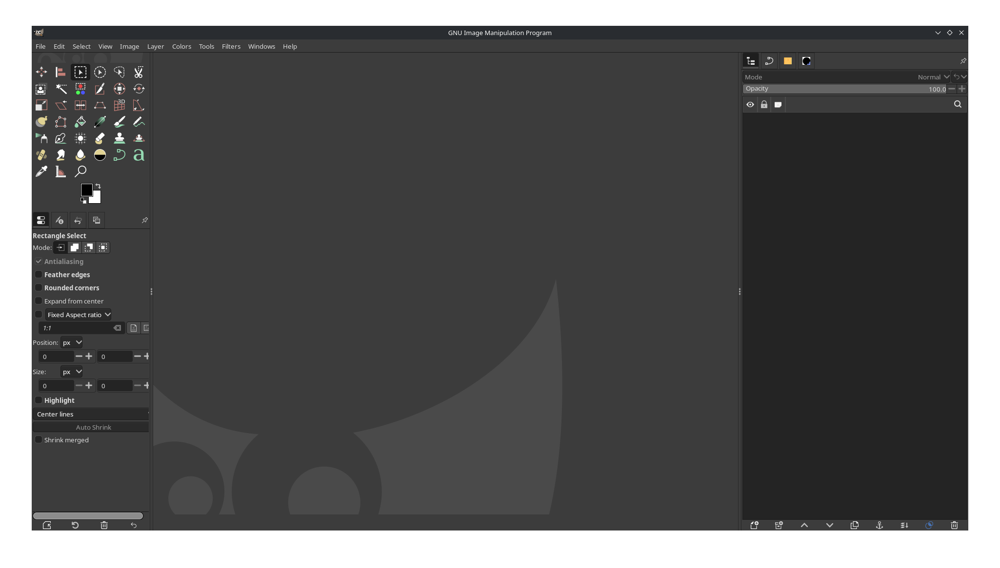
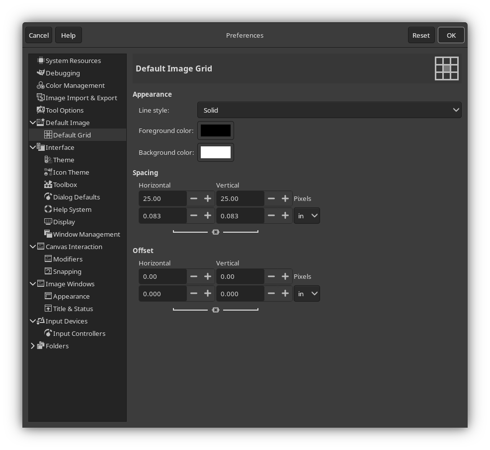
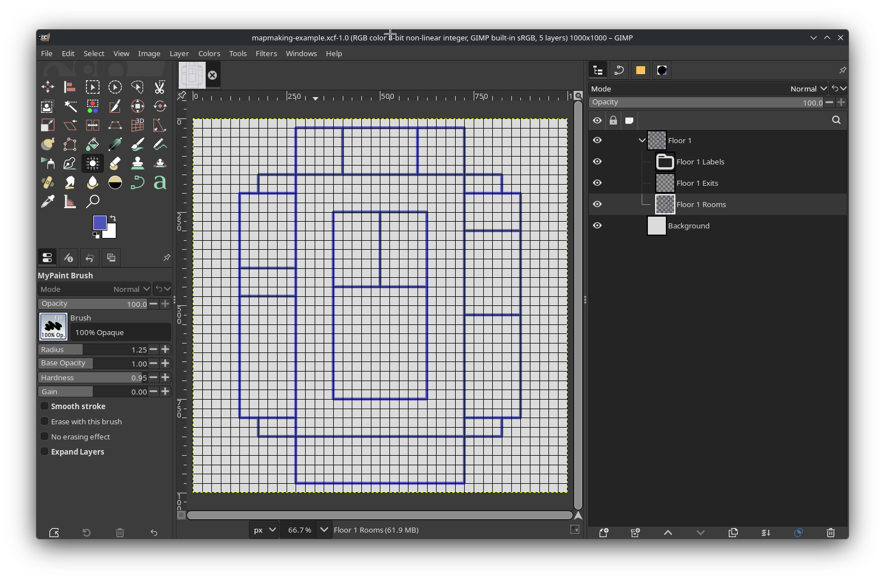
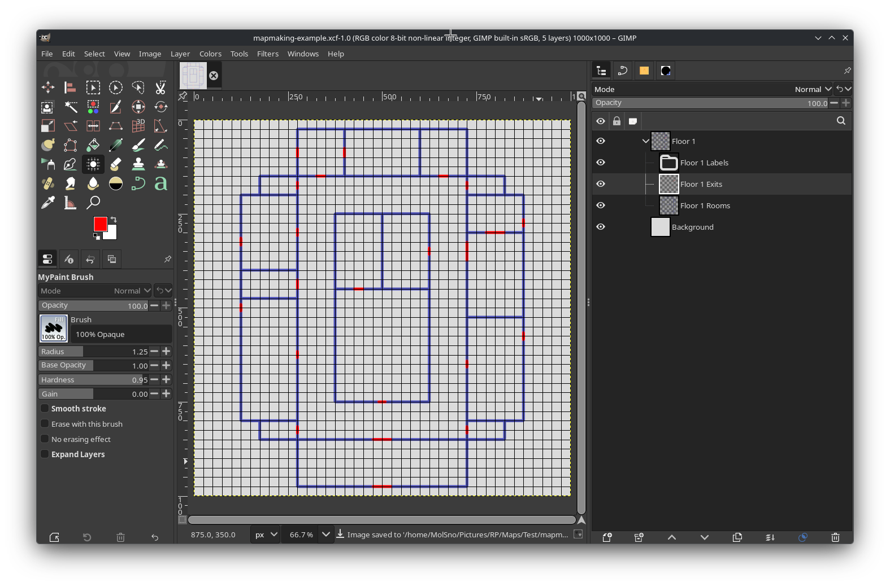
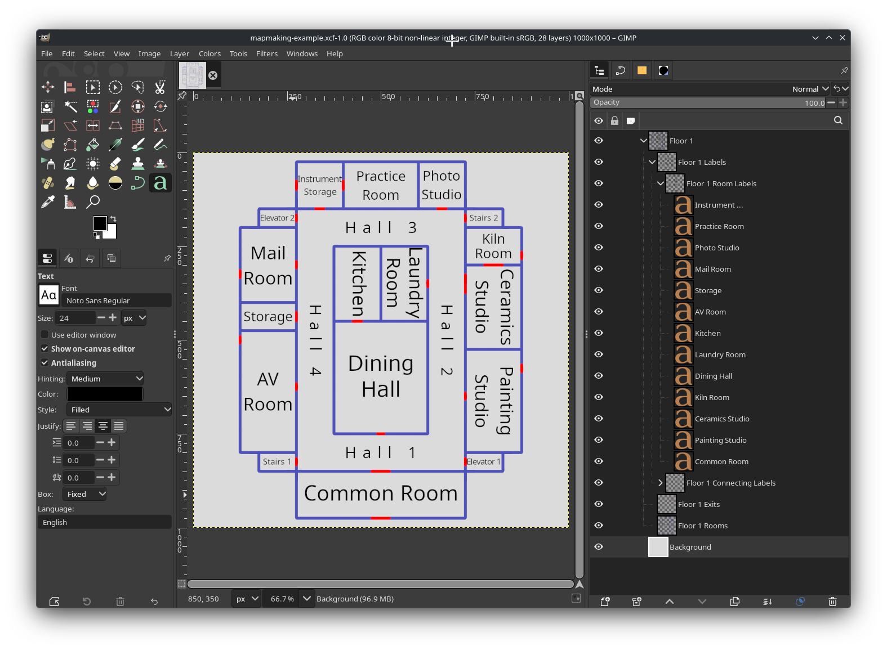
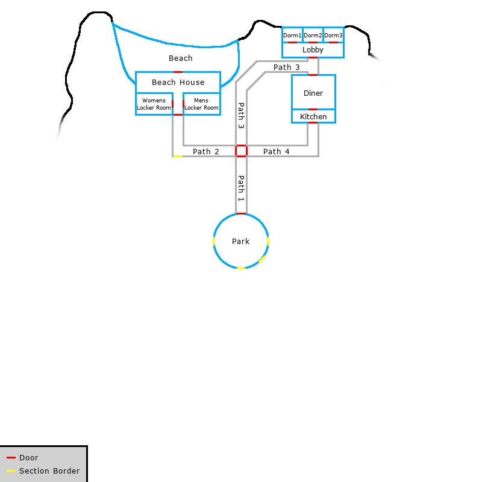
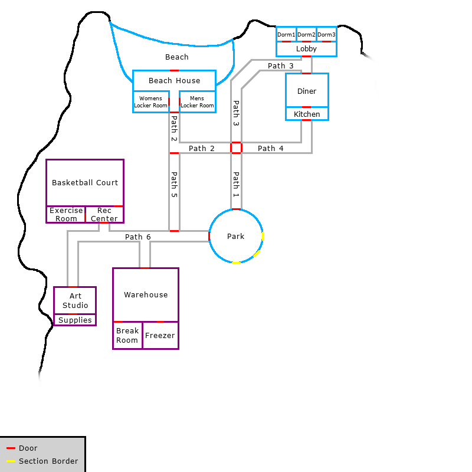
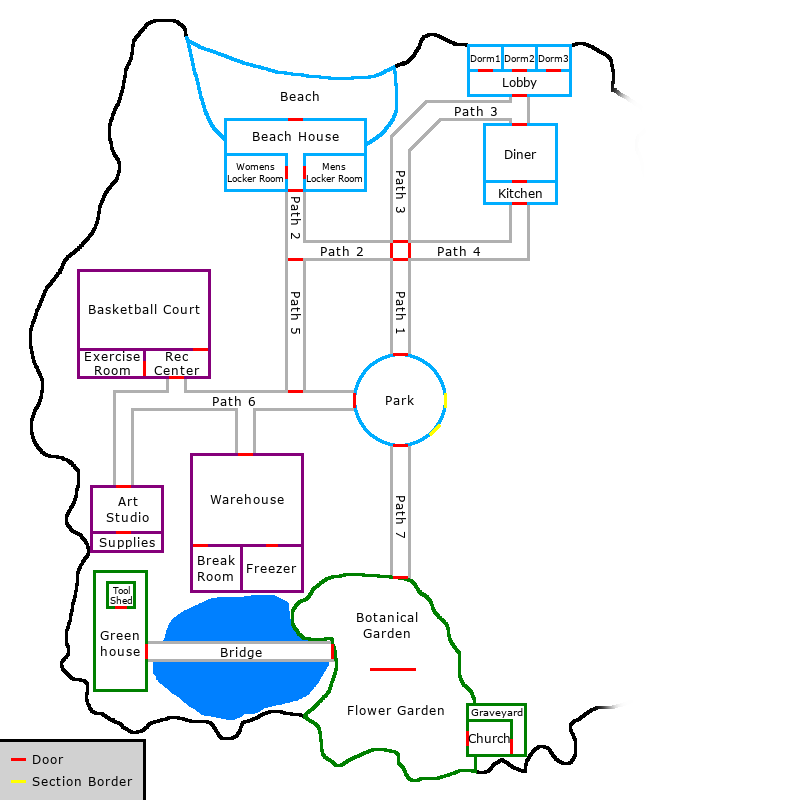
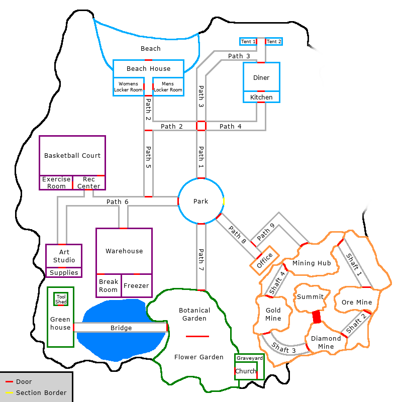

# Mapmaking

As the Alter Ego facilitates gameplay in the style of a text adventure, it can be somewhat disorienting for
players to navigate the game world. Although it is not technically required to use Alter Ego, creating a map is very
beneficial, both for moderators and for players. There are three key advantages to drawing a map:

1. It makes inputting [Exit positions](../reference/data_structures/exit.md#position) significantly easier,
2. It makes it easier to visualize the perspective when entering a room from a given Exit, thus making writing
   [its description](../reference/data_structures/exit.md#description) less challenging, and
3. It makes it easier for players to navigate the game world.

This tutorial will explain the process of making maps for Alter Ego. It will not teach you how to draw, or how to
create a subjectively good map. Be aware that the information in this tutorial is only a set of guidelines, and not
required by any means. You can make maps however you see fit.

## Part 1: Installing GIMP

In order to make a map, you will need image editing software that:

1. Allows you to draw,
2. Allows you to edit [raster graphics](https://en.wikipedia.org/wiki/Raster_graphics), and
3. Displays the current coordinates of your cursor.

Shockingly few image editing programs meet all three of these criteria. The third requirement, in particular, is not a
feature that most popular image editing programs have. Microsoft Paint does, but that program is too simplistic for the
purposes of drawing a map, and it is only available on Windows. Software with more advanced features and wider
compatibility is ideal. For the purposes of this tutorial, GIMP is recommended, as it satisfies all of these criteria.
You can download it for your operating system using the link below:

[https://www.gimp.org/downloads/](https://www.gimp.org/downloads/)

This tutorial will use version 3.2.4, as it is the latest version at the time of writing. However, you are free to use
a later version, if one is available.

When you open it, it should look something like this:

## Part 2: Configuring GIMP
There are a few steps that can make your experience using GIMP easier. Open the **Edit** menu and select
**Preferences**. In the box to the left, select **Default Grid**. It should look something like this:

This is where you can change the default grid size whenever you create a new image. The grid makes it easy to draw more
perfect geometrical shapes. It also makes it easier to create [Rooms](../reference/data_structures/room.md) with a
given dimension in meters.

If, when drawing your map, you follow a rule that 1 grid tile represents 1 square meter, then the dimensions of this
grid determine your [`PIXELS_PER_METER` setting](../reference/settings.md#pixels_per_meter). By default, that setting
is 25. If you want to follow that, enter 25.00 into the Horizontal and Vertical inputs under the **Spacing** heading.

You can configure any other preferences to your liking, as well. When you're done, press **OK** in the Preferences
window to save your preferences.

Next, open the **Edit** menu and select **Keyboard Shortcuts**, then search for "grid". Under "view" in the **Action**
column, you should see two actions:

- Show Grid
- Snap to Grid

You will be using the grid a lot, so having shortcuts to toggle these settings on and off will be very helpful. You can
set these to whatever you like, but for the sake of this tutorial, they will be set to **Ctrl+G** and **Shift+Ctrl+G**,
respectively. It should look something like this:

You can configure any other shortcuts you'd like, as well. When you're done, press **OK**.

## Part 3: Creating a new image

Open the **File** menu and select **New...** In the window that appears, you can select the image size. This is an
important decision, as it determines the scale of your map. It may be tempting to create a very large image. However,
keep in mind that the larger your image, the more space you have to fill up, and the longer it will take for a player
to traverse your map.

To give you a sense of scale, assume that [Players](../reference/data_structures/player.md) with three different
[speed stats](../reference/data_structures/player.md#speed)---1, 5, and 10---are traversing just the horizontal length
of your map. The width of your image in pixels will be displayed in the leftmost column. In the three other columns,
the amount of time it will take for each respective Player to walk that many pixels will be displayed, assuming
your `PIXELS_PER_METER` setting is set to the default value of 25.

| Image Width | Speed 1 travel time | Speed 5 travel time | Speed 10 travel time |
|:-----------:|--------------------:|--------------------:|---------------------:|
| 1000 pixels |                 43s |                 29s |                  14s |
| 2000 pixels |              1m 25s |                 57s |                  29s |
| 3000 pixels |              2m 08s |              1m 26s |                  43s |
| 4000 pixels |              2m 50s |              1m 54s |                  57s |
| 5000 pixels |              3m 33s |              2m 23s |               1m 12s |

In all likelihood, since your map will be more complex than just a straight line---Players move in three dimensions,
after all---the lengths of time shown here will be longer, depending on the size of your map.

It is better to start small and grow larger, if needed. For the sake of this tutorial, an image with the dimensions
**1000x1000** will be created. After setting your dimensions, expand the **Advanced Options** menu, and from the
**Fill with** dropdown, select **Transparency**. Then, press **OK**.

## Part 4: Preparing your map file

Before you start drawing, you should make a few preparations.

First, you'll want to set up the layers you'll be working on. This is an important first step, as it will make the
entire mapmaking process significantly easier. Open the Layers window (this may be docked, depending on your settings)
and create a new layer group. A new layer will be created with an icon that looks like a folder, most likely called
"Layer Group". You can right click on it and select **Edit Layer Attributes...** to give it a name, assign it a color
tag, and more. You can name it whatever you like.

> [!TIP]
> It is often useful to give individual buildings and floors their own named layer groups. This allows you to more
> easily separate them from the main map and export them as standalone images, so that players can view a map for
> that specific building or floor.

Now, with your layer group selected, there are two layers you should create. It will help if you give every layer a
unique name, so try to prefix these with the name of the layer group you just made:

- Rooms
- Exits

Next, make a new layer group _within_ your layer group, again ideally with the same prefix:

- Labels

Your layers should be sorted like this:

Now, with your layers created, select the Background layer and fill it in with a solid color of your choice. This will
make it easier to draw.

Next, open the **View** menu and make sure **Show Grid** and **Snap to Grid** are enabled.

Finally, open the **File** menu and press **Save...**. Save your map file somewhere that you won't forget. You're going
to want to save regularly as you draw your map.

## Part 5: Drawing preparations

You're almost ready to begin drawing. But before that, there are few things to keep in mind.

GIMP shows you the current position of your cursor; this is why it is recommended for making maps over more popular
drawing software such as Krita or Clip Studio Paint. As you move your cursor around the image in GIMP, its position
relative to the top-left corner of the image will be displayed in the bottom-left corner of the program, like so:

It is important to remember that the top-left corner of your canvas is position 0, 0. If you plan on expanding your map
after you've already begun entering Exit positions, it is going to be very challenging to do so if you change the
position of 0, 0 relative to the rest of the map.

For that reason, it is always best to draw close to the center of the map---in this example, that's position 500, 500---
and expand the canvas down or to the right, if necessary. Expanding the canvas up or to the left after Exit positions
have already been entered on the sheet is not recommended.

Lastly, it is important to choose a brush that you will use consistently, with the same settings every time. Once you've
begun drawing, you will have a difficult time making edits to your map if you can't remember what brush you used, or
what its exact settings were. Once you've selected a brush that you like, write its settings down somewhere that you
won't forget.

## Part 6: Drawing rooms

This is where the fun part of the mapmaking process begins. There are infinite possibilities for how you can draw rooms
on a map, so this section will merely offer some guidelines on how to do that effectively.

First of all it is very helpful to draw with straight lines. There are two reasons for this:

1. It makes it easier to draw your map and cleanly connect rooms to each other, and
2. It makes it easier to add labels (more on that later).

To draw a straight line, make sure that Snap to Grid is enabled, and click on an intersection on the grid with your
brush. Then, hold Shift, move your cursor to another intersection on the grid, and click on it. If you'd like to
constrain your line to angles in [increments of 15°](https://www.mathsisfun.com/geometry/unit-circle.html), you can also
hold Ctrl at the same time as Shift.

Before drawing a room, you should have a rough idea of what you're going to put there. It may be tempting from an
artistic point of view to create a very large map with lots of rooms, and many exits connecting them to each other.
However, keep in mind that you are drawing a map for a game, and you will have to fill each room with things for your
players to inspect and interact with. If your map has lots of rooms, but very little to do in each one, your players
will most likely not find your map fun and engaging to explore.

It is also important to keep in mind the scale of each room, and how they will connect to each other. If
a room appears very large on your map, it will be strange if its in-game description and layout do not match its size.
Additionally, if the rooms have too many exits connecting them to each other, this means you will have more Exit
descriptions to write, and this can be disorienting for players (although this can be used to great effect,
if done intentionally).

You are free to add details to your rooms on the map, such as their layout, but remember that doing so makes it
necessary to update your map if the layout changes when your write the room on the sheet. A simple map just showing the
boundaries of all of the rooms will suffice, like so:

## Part 7: Placing exits

Next, it's time to place markers for where the exits in all of the rooms are. This is a relatively straightforward
process, and mostly consists of drawing straight lines on your Exits layer. Ideally, you should use a color that
contrasts with every other color that you will use in your maps. You may draw different buildings or sections of your
map with different colors, but the color of your exits should be consistent for all of them.

If you're not sure what color to use, bright red (`#FF0000`) is usually a good option, but keep in mind that this, too,
can be difficult to contrast with other colors for people with
[red-green color blindness](https://en.wikipedia.org/wiki/Color_blindness). Whichever color you use to denote exits,
ensure that there is contrast not only in its hue, but also in its saturation and value. It may also help to have a key
somewhere in the image to denote what an exit is.

It is also helpful to align your exits with intersections on the grid. This will make it easier to enter their positions
on the Rooms sheet later. If you have Snap to Grid enabled, you won't need to be very precise in where you place your
cursor; the position displayed in the bottom-left will snap to the grid, as well.

When you're done, your exits may be placed something like this:

## Part 8: Adding labels

Placing labels on your map can be challenging, for one simple reason: GIMP doesn't offer a way to easily center text
vertically. It's easy to center text horizontally, but centering it vertically will require more work, and it usually
comes down to approximation.

When labeling your map, it is important to use a consistent font and color. The size of your font can vary---ideally,
it should be as large as it can be while fitting within the boundaries of the room---but the font itself should be
consistent and easy to read, and the color should contrast well with the color of the background.

To add text to your image, select the Labels layer group you made earlier. You may want to create more layer groups
within it, for the sake of better organization; for example, you may have a layer group specifically for room labels,
and another for hall or path labels. Then, open the Text Tool and click somewhere in the room you want to label. Type
the name of the room.

Now, to align it, open the Tool Options window (this may be docked, depending on your settings) for the Text Tool, and
next to **Justify**, select the **Centered** option. Expand the boundaries of the text box so that they extend from one
boundary of the room to the other, horizontally. Then, you can move the text vertically until it looks about centered---
you may need to disable Snap to Grid for this. It should look something like this:

Despite not allowing you to easily center text vertically, GIMP's text tools are quite flexible. For instance, you can
enter text in a variety of orientations. To enter text with a vertical orientation, select the **Use editor window**
option in the Text Tool's options window. There are several orientations to choose from, but one that is most often
useful is "Vertical, right to left (mixed orientation)". This will allow you to enter text rotated at a 90° angle, which
can be helpful for rooms that are taller than they are wide, like so:

As of version 3.0, GIMP also allows you to enter text at any angle, and along any path that you desire. However, this is
more complicated, and beyond the scope of this tutorial. For more information, see
[GIMP's official documentation](https://docs.gimp.org/3.0/en/gimp-image-text-management.html#text-context-menu).

When you're done adding labels, your map is basically complete!

From here, you can add any additional details that you want, and then open the **File** menu, and select **Export...**
to render it as a completed image.

## Appendix: Examples

Although the map made in this tutorial was relatively simple, more complex maps are possible. Several examples will
be presented here.

### Example 1: Mountain interior

This map is for the interior of a mountain, with a cave system. Note how most of the rooms have rugged outlines. Despite
that, some of the rooms (particularly those on the west side) are comprised of straight or right angles, implying they
were constructed by humans. On the east side are caves with more curved, twisted paths, implying they formed naturally.

Note that for all of the curved paths, the text curves along with the path itself, and remains mostly centered. Although
this is tedious to accomplish---it requires mastery over GIMP's Path Tool---it can be done.

This map is clearly meant to be disorienting for players to navigate, while not being so large that it's impossible to
find one's way around without getting lucky.

### Example 2: Evolving map

|                                 |                                 |
|---------------------------------|---------------------------------|
|  |  |
|  |  |

These demonstrate how a map can evolve over the course of a game. As each subsequent area unlocks, the
[fog of war](https://en.wikipedia.org/wiki/Fog_of_war) obscuring the map is gradually lifted. Additionally, some rooms
are replaced---such as the dorm building in the top right---or removed entirely---like Shaft 2 in the bottom right, to
reflect the actions of players who destroyed or otherwise made these rooms inaccessible.

This map is also drawn at a different scale, and with a different style than any others that have been shown so far.
There is also a key in the lower left-hand corner to indicate that red markers are for exits between rooms, while
yellow markers are for boundaries that are not passable to players yet.

### Example 3: Artificial biosphere

This map demonstrates how visual effects can be used to communicate more about the setting than simply where rooms are
in relation to each other. This area, labeled "Biosphere", has a number of natural-looking features, such as a spring,
a river, and several twisted, natural-looking paths. Several of the boundaries of the different rooms are unclear; for
example, it isn't immediately obvious where, precisely, the different paths begin and end, implying they are
interconnected, the way real paths in a forest would be.

Everything about this map indicates that it contains a "natural" environment, but it is clearly boxed into the confines
of an artificial, human-constructed space. To add to this effect, there are grid lines in the background, and all of the
map's features emit a subtle glow, evoking a futuristic, science fiction vibe.
