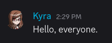
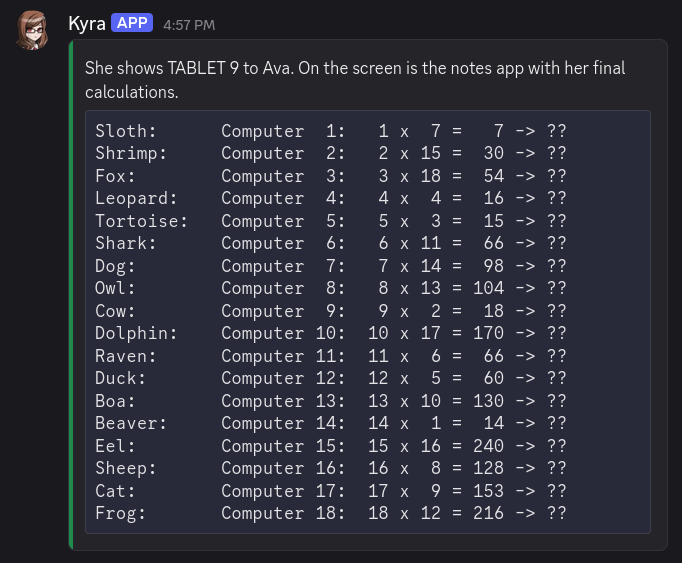
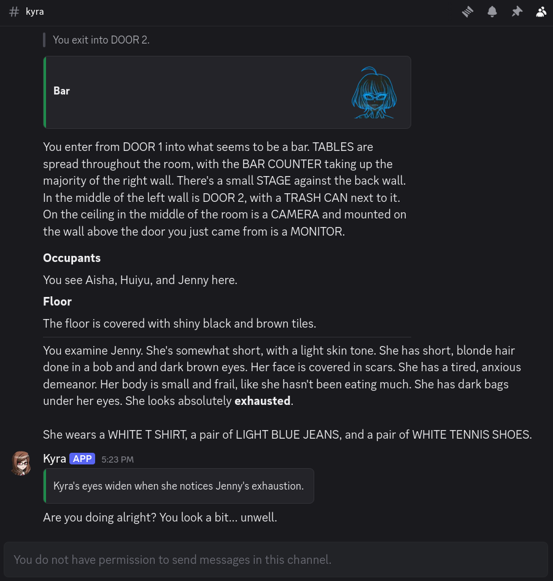

<!--
SPDX-FileCopyrightText: 2026 Amy Poon <amy@amypoon.me>
SPDX-FileCopyrightText: 2026 Ms. VBLANK <alteregomolly@pm.me>

SPDX-License-Identifier: CC-BY-SA-4.0
-->

# Expressing Yourself

Alter Ego is a game about role-playing with others. So what is a role-playing game without talking? This chapter will
teach you how to express yourself using words (and more!) in-game.

## Talking with Others

Talking in Alter Ego is simple; it doesn't even involve any commands! To talk, navigate to your **room channel** and
start sending messages. That's it! Now everyone in the room can read what your character is speaking.

Let's try that out.

```txt
Hello, everyone.
```



Simple, right? In Alter Ego, dialog is done in a **script** style, where spoken words are sent by themselves, without
any sort of quotation marks. It's just like sending a regular Discord message!

This might be somewhat jarring for role players who are more familiar with a **paragraph** style, but there are good
reasons for this! The most obvious one is that Alter Ego gameplay is much more fast-paced, and writing quotation marks
and sentences like "She said." takes time that could be better spent elsewhere. If you like the expressiveness and
introspection of _paragraph_-style role play, don't worry. Alter Ego has several tools you might like---we'll get to
those in a little bit.

### Shouting

Aren't there times when you're angry, or frightened, or just want to LET IT ALL OUT?! That's when you shout so loudly
that everyone in the house can hear you right? Good news is that you can do that too in Alter Ego. Bad news is that
it's just as embarrassing for everyone involved.

To **shout** in Alter Ego, you have two options:

1. Type your message in `ALL CAPS`. Watch out, though! If there are _any_ lowercase letters, it won't count as
   _shouting_. So `HELLO EVERYONE!` will count as shouting, but `HELLO everyone!` won't.
2. Begin your message with [Discord's heading Markdown characters](https://support.discord.com/hc/en-us/articles/210298617-Markdown-Text-101-Chat-Formatting-Bold-Italic-Underline#h_01GY0EQVRRRB2F19HXC2BA30FG).
   You can type between one to three hash/pound sign characters (`#`) and then a space, followed by the words you want
   to say, and it will count as _shouting_---you don't need to write in all uppercase this way. Although the size of the
   text can vary depending on how many hash characters you enter, they all function exactly the same.

*Shouting* in Alter Ego works in just about the same way as real life; characters that are in adjacent rooms can hear
you shout. This is one example of where your character's voice descriptor comes into play.

Let's try it out together. We will *shout* loudly a few times and see if others notice.

```txt
HELLO? CAN ANYONE HEAR ME?
# I am shouting very loudly!
## I am shouting a little less loudly, but I am still shouting!
### This, too, counts as shouting! Can you still hear me?
```


So, did anyone hear us? Let's check on a nearby room to find out:


Yes they did! It even used our character's voice descriptor instead of her name, since not everyone will be able to
recognize her by her voice.[^1]

### Speaking Quietly

Do you ever get sad or frightened, and start to speak quietly? Maybe you're too shy to speak up, or you always find
yourself muttering quietly to yourself. You can do that in Alter Ego, too!

To speak quietly, start your message with [Discord's subtext Markdown characters](https://support.discord.com/hc/en-us/articles/210298617-Markdown-Text-101-Chat-Formatting-Bold-Italic-Underline#h_01J2HBMKS7587KC8PMAJ47PZR2).
You can type a hyphen followed by a hash/pound sign and then a space (`-# `) before the words you want to say, and it
will be considered quiet dialog.

Let's try it out:

```txt
-# I see... nobody is here...
```


So, what does this do? Not much! If your dialog is written in `ALL CAPS`, this will cancel it out, and it won't be
considered _shouting_. Other than that, speaking this way doesn't have any special effects for the time being.

### Speaking Out-of-Character

There are times when we must speak **out-of-character (OOC)**. For instance, when we want to tell others that we're
stepping away from the keyboard, or if we want to comment on something funny.

> [!IMPORTANT]
> Any message that starts with a `(` is considered to be OOC. So don't include any dialog in them!
> Keep in mind, though, that even if you begin your message with
> [Discord's Markdown formatting characters](https://support.discord.com/hc/en-us/articles/210298617-Markdown-Text-101-Chat-Formatting-Bold-Italic-Underline),
> if the first character after them is `(`, it will still count as an OOC message.

To speak OOC in Alter Ego, we start our message with an opening parenthesis `(`. This tells Alter Ego that our message
is OOC and that it shouldn't be shown in [spectate channels](../reference/data_structures/player.md#spectate-channel).[^2]
Think of these messages as being off-the-record, as people spectating you won't see them.

Let's try this out by saying that we're going to the restroom.

```txt
(brb girls bio break
```

There, now everyone won't think we just disappeared into thin air.

### The _Say_ Command

If you've looked through the list of commands, you may have noticed that there's a
[_say_ command](../reference/commands/player_commands.md#say). Maybe you've even tried it yourself, only for Alter Ego
to tell you that you have no reason to use it. What's the deal with that?

It's pretty simple. Sometimes, you won't have access to the _room channel_, but you'd still be able to speak. For
example, maybe you've found an `ONNA MASK` lying around, and you decided to put it on. Now your identity has been
**concealed**. Now you can use the _say_ command to speak.

How do you do that? Simple! Just type the command, and then enter whatever it is you want to say. Let's try it out.

```txt
.say I've found this strange mask... do any of you know anything about it?
```

You won't get any message from Alter Ego, but it will send a [webhook message](https://support.discord.com/hc/en-us/articles/228383668-Intro-to-Webhooks)
in the _room channel_ communicating the dialog you said, like so:


For the most part, you won't be using the _say_ command except in rare situations. But it comes in handy when you
_do_ need it!

## Sharing Secrets

While it's all well and good to talk to everyone in the room (or everyone in adjacent rooms if we're shouting), there
are times when subtlety is warranted. This is where *whispering* comes in handy.

### The *Whisper* Command

If you wish to talk to other players in secret, you can [***whisper***](../reference/data_structures/whisper.md)
to them. This is done through the use of the [*whisper* command](../reference/commands/player_commands.html#whisper).
To *whisper* to one or more players, send `.whisper [player] [player2]...` while you are in the same room as the
other player(s).

Let's say we want to *whisper* to our friend Huiyu.

```txt
.whisper huiyu
```


This opens a **whisper channel** between us and Huiyu where we can share secrets!

Now let's try and say something to Huiyu in the whisper channel. Hmm... how about telling her about our secret plan to
achieve world domination through the use of bunnies?

```txt
Huiyu, it's very important that you keep this between us. I've just come into possession of a *very large rabbit,* and I'd like your help using it to conquer the world.
```


Others in the room can see that we are whispering, but can't actually hear what we're saying.[^3]

### Group Whispers

> [!NOTE]
> You can't add someone to a whisper channel that already exists, but if a person leaves the room or becomes otherwise
> incapacitated, they will be removed from the whisper channel.

Let's try starting a *whisper* circle with more people. I think our friends Jenny and Aisha would like to join our
secret plan as well so let's bring them into the fold.

We're going to start a new whisper channel with all three of them.

```txt
.whisper huiyu jenny aisha
```


## Performing Gestures

Do you ever want to do something non-verbal, like smile, shrug your shoulders, or point at something? Great news!
Alter Ego has a whole system to do exactly that. These are called **gestures**. This allows you to communicate with
other players non-verbally, without having to think too much about how to convey what you want to do in words.

### The _Gesture_ Command

If you wish to perform a _gesture_, you can use the [_gesture_ command](../reference/commands/player_commands.md#gesture).
Before we can do any _gestures_, though, we need to know which ones are available to us. Let's take a look by sending
this command:

```txt
.gesture list
```


Wow! There are _thirteen pages_ to look through![^4] This is helpful if you want to discover _gestures_ you didn't know
existed, or if you're confused what a certain _gesture_ does---the brief description explains that. But for the most
part, you can usually perform a _gesture_ just by guessing its name. Let's try it out, shall we?

```txt
.gesture smile
```


Simple enough, right? It looks almost as if we sent this message ourselves, but the text of the gesture is contained in
a block that makes it clear that this isn't spoken dialog.

What if we want to shrug, though? Should we enter `shrug shoulders`, or just `shrug`? Most gestures have the shortest
name they can have, so that they can be done without too much effort. So in this case, let's go with `shrug`. And for
even more convenience, let's use the short-form alias of the _gesture_ command:

```txt
.g shrug
```


That's easy, but what if we want to point at something? Thankfully, _gestures_ can be made to require a **target**. Did
you notice that in the _gesture_ list, there were several _gestures_ that seemed to have duplicates, where the only
difference was that the name ended with `at`? _Gestures_ that require _targets_ usually have names with prepositions at
the end. That way, after you type the name of the _gesture_, all you need to do is type the name of the _target_.
So, you're usually typing something that makes grammatical sense. For example, let's try pointing at our friend Huiyu:

```txt
.g point at huiyu
```


It worked! If you're ever confused about a _gesture_, remember that you can always check its description in the list.

## Narrating Your Actions

What if you want to communicate non-verbally, but _gestures_ just aren't cutting it? Maybe there isn't a _gesture_ for
what you want to communicate, or maybe the action you want to do is just too complex to be described in a simple
_gesture_. Or perhaps, you just want to sprinkle some movement into what is otherwise a standard dialog message? You
can do all of those things, with **narrations**!

> [!IMPORTANT]
> All of Alter Ego's built-in narrations are written in third-person present tense. You should do your best to write
> your narrations in this form.

### Code Block Narrations

For many years, Alter Ego offered no way to narrate your actions aside from _gestures_. As a result, a pattern of using
**code blocks** as narrations emerged. While this is largely no longer necessary (we will see why in a moment), they can
still offer some utility, especially if all you want to do is sprinkle a narration into your regular dialog.

Discord allows you to type inline code blocks by surrounding text with tics (`` ` ``). You can send these in any
message to denote that something is not part of the usual dialog. Let's give it a try:

```txt
I have been busy with... `She pauses, bringing a finger to her chin.` Several things. What about you?
```


See how the text we surrounded in tics looks different from the rest of the message? That's a _code block_. It looks
clearly distinct, which makes it useful for writing short narrations like this. The main downside is that it doesn't
allow you to use formatting characters within it, so you can't write anything in **bold**, _italics_, or any other forms
of emphasis.

> [!WARNING]
> Alter Ego doesn't treat narrations sprinkled into dialog with code blocks as distinct from the rest of the dialog.
> They _will_ be treated as spoken dialog so don't type anything in them that you don't want other people hearing.

### The _Narrate_ Command

As of Alter Ego version 2.0, there's a new way of narrating your character's actions that offers a lot more flexibility:
the [_narrate_ command](../reference/commands/player_commands.md#narrate).

To use the _narrate_ command, type the command itself, followed by whatever it is you want to narrate. Let's try a
simple example:

```txt
.narrate She nervously rubs her arm and turns her head away, averting her eyes.
```


It looks just like a _gesture_, doesn't it? They work very similarly! The _narrate_ command allows you to write much
more complex narrations than _gestures_ can provide, making it perfect for expressing your character non-verbally.

The other advantage of the _narrate_ command that makes it significantly better than using _code block_ narrations is
that it allows you to use Discord's Markdown characters to emphasis and style to your narrations. Let's try another
example, this time using the short-form alias for the _narrate_ command:

```txt
.n Kyra crosses her arms, brows furrowed. She looks absolutely **furious** as she glares intently at the person across from her. The fact that she can maintain her dignity and composure even when her anger is *this* palpable makes the daggers in her eyes feel that much sharper.

She huffs indignantly, and then begins to speak with low, steady tone of voice, every word feeling deliberate and calculated.
```


You can even include code blocks in the _narrate_ command! This can be helpful in showing people what you've found, if
you have an item in-game that you would be able to take notes on.

````txt
.n She shows TABLET 9 to Ava. On the screen is the notes app with her final calculations.
```
Sloth:      Computer  1:   1 x  7 =   7 -> ??
Shrimp:     Computer  2:   2 x 15 =  30 -> ??
Fox:        Computer  3:   3 x 18 =  54 -> ??
Leopard:    Computer  4:   4 x  4 =  16 -> ??
Tortoise:   Computer  5:   5 x  3 =  15 -> ??
Shark:      Computer  6:   6 x 11 =  66 -> ??
Dog:        Computer  7:   7 x 14 =  98 -> ??
Owl:        Computer  8:   8 x 13 = 104 -> ??
Cow:        Computer  9:   9 x  2 =  18 -> ??
Dolphin:    Computer 10:  10 x 17 = 170 -> ??
Raven:      Computer 11:  11 x  6 =  66 -> ??
Duck:       Computer 12:  12 x  5 =  60 -> ??
Boa:        Computer 13:  13 x 10 = 130 -> ??
Beaver:     Computer 14:  14 x  1 =  14 -> ??
Eel:        Computer 15:  15 x 16 = 240 -> ??
Sheep:      Computer 16:  16 x  8 = 128 -> ??
Cat:        Computer 17:  17 x  9 = 153 -> ??
Frog:       Computer 18:  18 x 12 = 216 -> ??
```
````



Pretty cool! As you can see, the _narrate_ command offers a lot of flexibility.

## Spectate Channels

Did you know? Alter Ego has a feature called **spectate channels**. There's a channel for every player in the
game---including you!---in which everything that player says, hears, sees, and does is mirrored in real-time. These are
a powerful feature of Alter Ego's, as they can easily make spectating a game almost as fun as playing in it yourself.

_Spectate channels_ may be hidden from you while you're playing, but when the game is over, you should be given access
to them automatically. Since everything is logged there in real time, they offer a means of reading back on old
Alter Ego role plays from the perspective of _any_ character, in chronological order.

So, what does a _spectate channel_ look like? Let's open up Kyra's channel, shall we?



It looks just like a normal Discord channel, but everything---room descriptions, narrations, dialog, whispers,
and more---is stored in one place, sent in chronological order. It makes keeping track of a given player's perspective
_very_ easy, as you see everything that they see. Player dialog and narrations are even mirrored here using webhook
messages, similar to the _say_ command!

> [!IMPORTANT]
> If you edit dialog messages quickly after you send them, those edits will be reflected in spectate channels. However,
> the avatar you had when you sent the message will be immortalized in the webhook message; it can't be changed once
> it's been sent. For that reason, it is **highly** recommended you set your avatar to an image of your character. If
> you have Discord Nitro, you can set your avatar for just the server, and leave your main avatar untouched; your server
> avatar will take priority when your messages are mirrored in spectate channels. This is true of every situation where
> Alter Ego uses webhooks, including _gestures_ and _narrations_.

## Monologuing

Do you ever wish you could write down your character's inner thoughts, but you don't want other players to be able to
read them? That's where **monologs** come in handy!

### The _Monolog_ Command

> [!NOTE]
> Although the American form of the word _monologue_---_monolog_---is rarely used, it has been chosen
> for the sake of symmetry with Alter Ego's use of the form _dialog_. However, the more common _monologue_
> is an accepted alias of the command.
>
The [_monolog_ command](../reference/commands/player_commands.md#monolog) works similarly to the _narrate_ command. The
key difference is that when you use the _monolog_ command, the output will only be sent to you, and to your _spectate
channel_. This not only allows you to keep track of what your character is thinking, but also makes it clear to
spectators.

Let's give it a try!

```txt
.monolog Why is all of this alcohol here...?
```

Alter Ego will send us a copy of our _monolog_:


But if we look in Kyra's _spectate channel_, it looks different:


As you can see, it looks similar to a narration, but the container block doesn't have an accent color, indicating that
it's not exactly the same. And sure enough, if you look in the _room channel_ or the _spectate channels_ of other
players, you won't see a thing.

> [!TIP]
> Whether you want to write _monologs_ in first or third person is a matter of personal preference.
> Just try to be consistent!

Just like with the _narrate_ command, you can format _monologs_ however you like. Let's try it out, this time using one
of the short-form aliases for the command:

```txt
.mn An asteroid...

> *"Axiom two: This facility is a nuclear bunker.*
>
> *Designed to withstand the end of life as we know it upon the surface of the Earth. Namely, nuclear warfare. But probably useful for climate collapse, too."*

Stephanie... she was right, then? Is that this facility's true purpose?
```


Wow, that was dark! But hopefully you get the idea by now. _Monologs_ are another powerful tool Alter Ego offers you to
enhance your role playing experience.

Now that you know how to express yourself, have fun role playing to your heart's content!

[^1]: It's possible for players to recognize each other by the sounds of their voice. If someone who recognized Kyra's
voice was in the room, they would receive a private message saying
`Kyra shouts "HELLO? CAN ANYONE HEAR ME?" in a nearby room.` and the like, every time she shouted. If you're curious how
that works, [see this section](../reference/data_structures/status.md#knows-player-name).
[^2]: Don't worry about knowing what spectate channels are yet, we'll be going into them later.
[^3]: Technically it _is_ possible for other players to hear our whispers, but this has historically been rare. To learn
more, [check out this section](../reference/data_structures/status.md#acute-hearing).
[^4]: There may be more or fewer pages depending on if your Moderator has added or removed _gestures_ from the game.
There may also be fewer pages if you are inflicted with certain _status effects_ that prevent you from performing
specific _gestures_.
