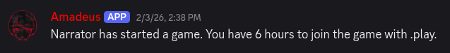
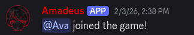

# Getting Started

> [!NOTE]
> This guide assumes that you know how to use Discord.
> If you are unfamiliar with Discord, please first refer to the [Beginner's Guide to Discord](https://support.discord.com/hc/en-us/articles/360045138571-Beginner-s-Guide-to-Discord).

Congratulations! If you are reading this, it probably means that you have been invited to play in an Alter Ego game.
Learning to play Alter Ego may seem intimidating at first, but once you get the hang of it, you'll be able to explore and interact in a rich game world like it's your second nature.

This guide will teach you the basics for playing Alter Ego. The following chapters will teach you how to look around, move around, interact with objects, solve puzzles, talk to others, and more.

## Creating Your Character

To play an Alter Ego game, you must have a **character**. Your character represents your persona in the game world and
everything you do in the game will be done through your character.

Your moderator may have already given you guidelines on how to create your character. If that is the case, follow
their instructions.
Typically, your moderator will ask you several questions, or ask you to complete a questionnaire, outlining your
preferences for your character.
An Alter Ego character has several attributes, of which can be broadly broken down into **basic information**,
**appearance**, **inventory**, and **stats**. The questions that your moderator will ask should cover most of these.

When creating a character, you will need to decide on their basic information. This consists of their name and pronouns.
When choosing a name, it would be wise to consider their nationality and the language they speak.
Having a name that fits with their background can help a character feel lifelike.
Your character can have any set of pronouns that you wish.
Alter Ego supports masculine (he/him), feminine (she/her), and neutral (they/them) pronouns out-of-the-box.
If your character has neo-pronouns, provide your moderator with all of its forms.
See the [player reference](../reference/data_structures/player.md#pronoun-string) for more details.

For your character's appearance, you will typically need to decide on their height, complexion, hair length and style, physique, and voice quality.
Keep in mind that these can change depending on your moderator, so consult with them for more details.
Having a drawing of your character will help you visualize them.
It will also serve as your Discord profile picture to help others identify you.
Many players make theirs on character generation sites such as [Picrew](https://picrew.me/en) or [Charat](https://charat.me/en/).
Of course, you can draw your own or even commission art for your character!

Your character's inventory includes the clothes that they're wearing and what they're carrying.
It's a good idea to first consult your moderator on what clothing is appropriate for the setting, and what items your character can have.
For instance, it may not be appropriate for your character to be wearing swimwear in the dead of winter or for them to carry a rocket launcher.
A good inventory should both fit with the world and express your character's personality.
Instead of thinking about how certain clothing or items may benefit your character (a form of [metagaming](https://en.wiktionary.org/wiki/metagaming)), think of how your character would *choose* to wear or carry in the game's setting.
Your moderator always has the final say on what your character is allowed to wear or have.

Finally, your character will have statistics, which are numerical attributes that define your character's abilities in game.
They affect things such as how fast your character can move, what they notice in-game, and how they do in skill check rolls.
Unlike the previous aspects, these are determined by your moderator based on your character's description and personality.
You shouldn't worry too much about these and should avoid trying to create a character that optimizes for the highest stats possible.
A character's stats helps to situate a character in a game world, and a character that only has high numbers and no personality will feel lifeless to play and spectate.

Remember, when you are playing a game of Alter Ego, you are playing in a world created by your moderator and it is important to create a character that fits with the setting.
For instance, it would probably be disrespectful to insist on playing a character with neon hair and quirky clothes when your moderator had envisioned a dark and gritty setting.
Therefore, instead of bringing a fully completed character to your moderator and asking for them to be included in the game, it's better to work with your moderator to craft a character that feels natural to be living in the game world.

## Joining a Game

Before you are able to play Alter Ego, you must join the game. You have probably already been invited to the Discord
server where the game will be taking place. If you haven't already, ask your moderator about being invited into
the server.

Once you are in the game server, your moderator will give you the
[*Eligible* role](../appendix/manual_installation/channel_and_role_creation.html#eligible).
When your moderator is ready to start the player registration process, an announcement with instructions on how to
join the game will be posted in the `#general` channel of the server.



To join the game, send the [*play* command](../reference/commands/eligible_commands.html#play) to the `#general`
channel within the time limit.
```txt
.play
```



If everything went well, another message confirming your registration will be posted in the same channel.
Now that you have been registered, all you have to do is wait for the game to begin!
Before doing that though, make sure to continue reading to learn about how to play a game with Alter Ego.
