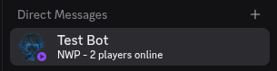
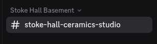
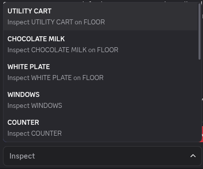
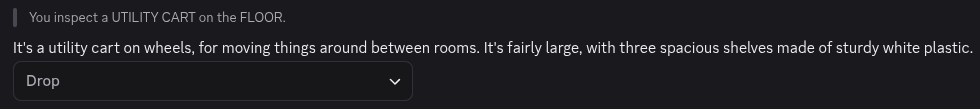
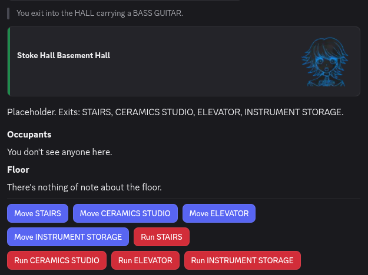
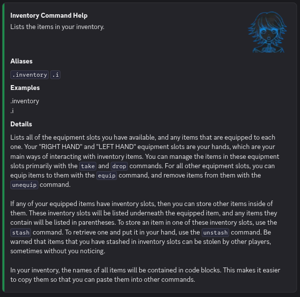

<!--
SPDX-FileCopyrightText: 2026 Amy Poon <amy@amypoon.me>

SPDX-License-Identifier: CC-BY-SA-4.0
-->

# Getting to Know Alter Ego

Now that you've joined an Alter Ego game, it would be a good idea to familiarize yourself with the user interface of Alter Ego before the game starts.
After all, you don't want to be panicking and trying to hunt down channels and [commands](../reference/commands/index.md)
when you are trying to role play!

## Getting Situated

You play Alter Ego by interacting in **room channels** and **direct messages**.
When a game of Alter Ego starts, you will get a direct message (DM) from the Alter Ego bot,
which will be a description of the current [*room*](../reference/data_structures/room.md) that you are in.



This DM will be the primary way for you to interact with Alter Ego. It is here that you will send commands
to Alter Ego and receive their outputs. It is also where most of the system messages that Alter Ego will send you will
be.

> [!WARNING]
> If Alter Ego can't send you direct messages, you won't be able to play! Before the game begins, open the settings
> menu for the game server, and select `Privacy Settings`. Check if `Direct Messages` from members of the server are
> enabled. If they're disabled, you'll have to enable them before the game begins.

Switching to the game server itself, you might notice that a channel with the name of the room your character is in
has become accessible.



This is the **room channel**, the primary way you interact with other players. In this channel, you can talk to other
players and also send commands. One important thing to note is that your room channel changes *every time* you move to
a new location, so remember to switch to the new room channel! You don't want to miss the conversation every time you
switch *rooms*!

> [!TIP]
> To make your life easier, try having **two instances of Discord open at the same time** while playing Alter Ego.
> To do this, open the Discord app on your computer while being logged in to Discord on your web browser.
> Alternatively, you can have the Discord app open on both your computer or your smart device.
> One of them will be open to the Alter Ego bot's DMs while the other will be open to the current room channel.
> This makes it a lot easier to interact with others and send commands simultaneously.

## Using Commands

**Commands** are the primary way you interact with Alter Ego. You can use commands in **both** in DMs and in
room channels.

To use a command, enter the **command prefix** (by default `.`)[^1] and append it with the command you wish to use.
For instance, if we want to use the [*inspect* command](../reference/commands/player_commands#inspect), we send
the following in Discord:

```txt
.inspect
```

We should now see that Alter Ego has sent a response to our *command*.


Whoops! It seems like we have to actually specify what we are trying to look at for the *inspect* command to work.
Let's try again. How about we try *inspecting* the *room* we're in? To do this, append "room" as an **argument** after
the command.

```txt
.inspect room
```


Awesome! It seems that we're in the ceramics studio, maybe we can make a vase for our flowers...

The *inspect* command is one of the many commands you can use to interact with Alter Ego.
While all of them are different, they all work in essentially the same way:

1. Enter the command prefix[^2] (`.`).
2. Enter the command (e.g. `inspect`, `give`).
3. Enter one or more arguments (e.g. `room`, `kyra bottle`).
4. Send the command string in either the bot DM or a room channel.

If you wish to learn about what other commands are available, refer to the [commands reference](../reference/commands/player_commands.md).

## Clicking on Interactables

Have you noticed those blue and red buttons in the screenshot above? How about the dropdown menu?
These are [**interactables**](../reference/interactables.md) and they allow you to perform common actions in Alter Ego
with your mouse or touch screen, all without using any commands! Let's try them out.

If we click on the `Inspect` dropdown, we see a list of items in the *room* that we can have a look at.



Let's try and have a look at the `UTILITY CART` by clicking on the dropdown menu item.



Nice, we know what the `UTILITY CART` looks like now! Ignore the *Drop* dropdown for now, we will cover that in a later
chapter.

Now let's try clicking on one of the buttons in the original message. We will click on the blue `Move HALL` button and
see what happens.



Awesome! We've moved to the basement hall---all without sending a single command. Convenient right?

At the moment, interactables allow you to *inspect* things, move to *rooms*, pick up items, craft held items, and more.
This means that most of what you will do in Alter Ego can be replaced with interactables.


## Seeking Help

> [!IMPORTANT]
> Not all functions can be replaced by interactables. Just because something isn't possible to do with
> interactables, doesn't mean it's not possible. Always see if there is a command for what you're trying to do
> before giving up.

Even though interactables can do a lot, not **all** functions can be replaced by interactables
(such as using items or solving puzzles), so there are still some commands that you will have to learn.
Alter Ego has many commands and it's not always clear to a beginner on how to use them.
That's where the [*help* command](../reference/commands/player_commands.md#help) comes in handy.
Let's try it out for ourselves. We'll type the *help* command in our Bot DMs.

```txt
.help
```


Wow! Isn't that neat? The *help* command gives us the entire list of commands that we can use!
There are even interactable buttons on the bottom so we can go to the next page of commands.

We see on the list that there is a command named *inventory* that let's us see what we are carrying.
Let's see how we can use that command. To do that, we append the name of the command as an argument
after the *help* command.

```txt
.help inventory
```



Looking at this help entry, we can see that it includes something called **aliases**. Aliases are other ways you can
invoke a command. In this case, we can see that the inventory command only has one: `.i`, whereas other commands may
have multiple aliases. These aliases let you use commands easier, especially when you are using multiple of the same
command.

The help entry also includes **examples** on how to use the command. In this case, there is only one way to use it,
but other commands may have more complex example usages.

Finally, each help entry has **details** about the command. In this case, it explains what the inventory command does
and the specifics on using it. With this information, we can list our character's inventory no problem!

[^1]: The command prefix is customizable by the moderator. If your moderator uses another prefix, use that instead.
[^2]: This is not strictly necessary in **bot DMs**. They are still required in room channels.
