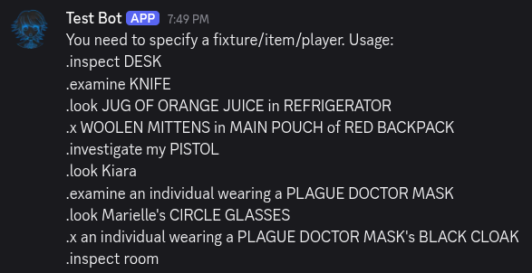
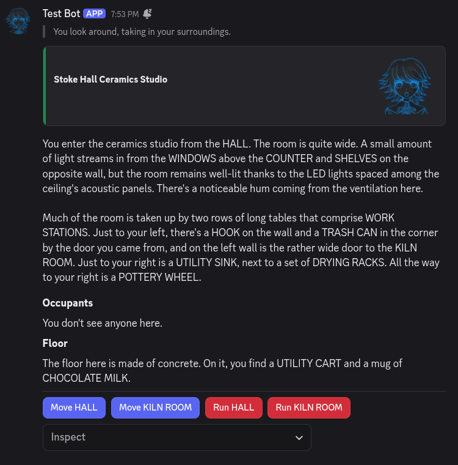
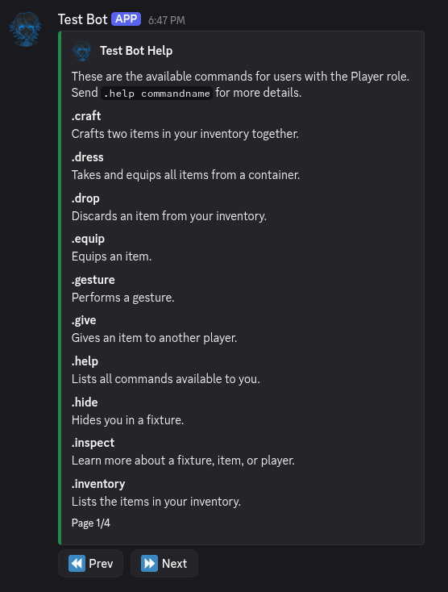

# Getting to Know Alter Ego

Now that you've joined an Alter Ego game, it would be a good idea to familiarize yourself with the user interface of Alter Ego before the game starts.
After all, you don't want to be panicking and trying to hunt down channels and commands when you are trying to role play!

## Getting Situated

You play Alter Ego by interacting in **room channels** and **direct messages**.
When a game of Alter Ego starts, you will get a direct message from the Alter Ego bot, which will probably be a description of the current room you are in.


This direct message will be the primary way for you to interact with Alter Ego.

Switching to the game server itself, you might notice that a channel with the name of the room your character is in has become accessible.


This is the **room channel**, the primary way you interact with other players.
In this channel, you can talk to other players and also send commands.

One tip to make your life easier is to have two instances of Alter Ego open at the same time.
To do this, open the Discord app on your computer while being logged in to Discord on your web browser.
Alternatively, you can have the Discord app open on both your computer or your smart device.
One of them will be open to the Alter Ego bot's DMs while the other will be open to the current room channel.
This makes it a lot easier to interact with others and send commands simultaneously.

## Using Commands

Commands are the primary way you interact with Alter Ego.
You can use commands in *both* in **direct messages** and in **room channels**.

To use a command, enter the command prefix (by default `.`) and append it with the command you wish to use.
For instance, if we want to use the [inspect command](../reference/commands/player_commands.html#inspect), we send the following in Discord.

```txt
.inspect
```

We should now see that Alter Ego has sent a response to our command.



Whoops! It seems like we have to actually specify what we are trying to look at for the inspect command to work.
Let's try again. How about we try inspecting the room we're in?
To do this, append what you are trying to inspect after the command.

```txt
.inspect room
```



Awesome! It seems that we're in the ceramics studio, maybe we can make a vase for our flowers...

The inspect command is one of the many commands you can use to interact with Alter Ego.
While all of them are different, they all work in essentially the same way:

1. Enter the command prefix (`.`).
2. Enter the command (e.g. `inspect`, `give`).
3. Enter one or more arguments (e.g. `room`, `kyra bottle`).
4. Send the command string in either the bot DM or a room channel.

If you wish to learn about what other commands are avaliable, refer to the [commands reference](../reference/commands/player_commands.md).

## Clicking on Interactables

Have you noticed those blue and red buttons in the screenshot above? How about the dropdown menu?
These are Interactables and they allow you to interact with Alter Ego with your mouse.

## Getting Help

Alter Ego has many commands and it's not always clear to a beginner on how to use them.
That's where the [help command](../reference/commands/player_commands.md#help).
Let's try it out for ourselves. We'll type the help command in our Bot DMs.

```txt
.help
```


Wow! Isn't that neat? The help command gives us the entire list of commands that we can use!
There are even interactable buttons on the bottom so we can go to the next page of commands.

The help command
