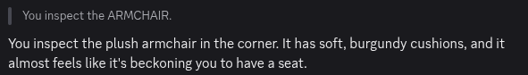

<!--
SPDX-FileCopyrightText: 2026 Amy Poon <amy@amypoon.me>

SPDX-License-Identifier: CC-BY-SA-4.0
-->

# How to Use This Guide

> [!NOTE]
> This Player Guide is a work in progress. Further chapters will added as they are written.

This guide is designed to help you get started with Alter Ego as a player. We wrote this guide in a casual,
conversational tone to ease new players like you into Alter Ego. It contains many images and examples to make it easy
for you to follow along. We hope that you will find this guide helpful as you embark on your journey in mastering how
to play Alter Ego!

As Alter Ego is a game that is entirely played on Discord, this guide assumes that you are familiar with using it.
If you are unfamiliar with Discord, please refer to the
[Beginner's Guide to Discord](https://support.discord.com/hc/en-us/articles/360045138571-Beginner-s-Guide-to-Discord)
first before proceeding.

## Navigating This Guide

We designed this guide to be read from start to finish, with new concepts being introduced gradually as you progress.

To go to the next chapter, either click / tap the **>** button on the side (or the bottom on mobile) or use the left
and right arrow keys on your keyboard.

If you want to skip ahead or go back to a page, there is a table of contents on the side of the page (or under the
hamburger menu on the top left on mobile). This guide is listed under the **Player Guide** heading there.

If you clicked on a link and don't know where you are, press the back button on your browser to return to the page
you were just on.

We recommend **reading this guide first** before delving into the rest of the documentation.

## For Moderators

If you are introducing your players to Alter Ego for the first time, please link them to this page instead of the
home page, as the home page leads directly into moderator documentation.

It would also be useful to read this guide yourself to get on the same page as your players.

## Typographic Conventions

For clarity, we use the following typographic conventions in this guide to make different concepts in this guide
more distinct and easier to understand.

### Admonitions

Admonitions are used when presenting concepts that require your attention. They come in several forms in order of
ascending importance:

> [!TIP]
> This denotes useful tips and tricks that can help you.

> [!NOTE]
> This denotes things you should pay attention to.

> [!IMPORTANT]
> This denotes important things you should not miss.

> [!WARNING]
> This denotes things that may cause harm if not handled properly.

> [!CAUTION]
> This denotes things that **will cause harm** if ignored.

### Commands

When a command is shown for demonstrative purposes, they are presented enclosed in code blocks:

```txt
.inspect armchair
```



A screenshot of the output of the command (what you see in Discord after a command is received by Alter Ego) is included
immediately following its invocation. This is so that you can see what the command does as if you sent it yourself.

### Footnotes

Footnotes are used to provide additional context or information about a term or concept.[^1]

### Key Words and Emphasis

**Key words** are important terms and concepts that we will go over in this guide. The first time they're used, they
are presented in **bold**. Some important concepts are also put in **bold for emphasis**.

### Literals

Literals are text that is quoted from somewhere else unmodified. This is to show that the text is situated in its own
context and not meant to be read as just part of the sentence. They are presented enclosed by `inline code blocks`.

For instance, a name of an in-game item such as `COFFEE TABLE` or a command with its prefix such as `.use` are
presented as literals.

### Names

When the name of a data structure[^2] that has an ordinary meaning is mentioned, it is presented in *italics*.
This is to distinguish it from the word's meaning in everyday language.

For instance, this is the [*inspect* command](../reference/commands/player_commands.md#inspect) and this is a
[*puzzle*](../reference/data_structures/puzzle.md). We *inspect* things to help us solve *puzzles*.

It's not necessary to go to one of those pages as they can get really technical, but a link to it is provided for it
the first time it is mentioned in a chapter for your curiosity.

[^1]: Not reading them will not significantly impact your understanding of this guide.
[^2]: A data structure is something that exists in the internal workings of Alter Ego.
