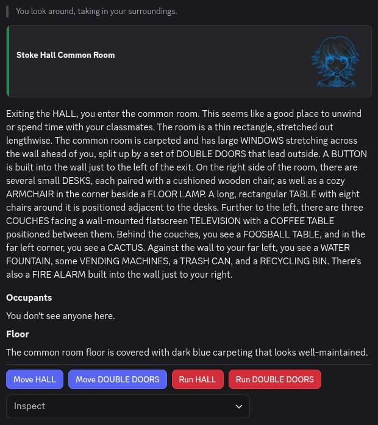

<!--
SPDX-FileCopyrightText: 2026 Alter Ego Contributors

SPDX-License-Identifier: CC-BY-SA-4.0
-->

# Interacting with Things

Why inspect things?
That's because it would be almost impossible to interact with something if you don't know that it exists in the first
place!
This chapter will teach you how to inspect things in the world and how to interact with them.

## Inspecting Things

One of the things you will do most in Alter Ego is **inspect** things. Whether it be an item, a fixture, or another
player, inspecting allows you to get an idea of how you can interact with them.

Remember when we learned how to use commands earlier? If you do, then you already know the basics of inspecting.
We will dive deeper on how to use the command and more importantly how to interpret its output here.

### The *Inspect* Command

To inspect something, you use the [*inspect* command](../reference/commands/player_commands.md#inspect).
The first thing you should do when you're not sure what to do is to inspect the room that you're in. This is done
automatically for you when you first enter a room and will give you information on what you can interact with.

> [!TIP]
> Many commands have short form aliases! This can save you a lot of time when using commands repeatedly.
> Try using the [*help* command](../reference/commands/player_commands.md#help) to see if your favorite command
> also has one!

Let's try inspecting a room together. We will use the short form alias this time for brevity.

```txt
.x room
```



It seems that we're in the Stoke Hall Common Room. The first section of this output we see is a banner showing the
name of the room. The next section a written **description** of what the room looks like and what is in the room.
We then see a section on the **occupants** of the room. There is then a section about the **floor** of the room.
Finally, there are a number of **interactables** at the bottom of the output.

Let's have a look at the description of the room. If you're wondering how we can tell what we can inspect, most things
that can be inspected will be in ALL CAPS (except for exits). For instance, we can see that we can inspect the ARMCHAIR
in the room.

```txt
.x armchair
```

### Inspecting With Interactables

> [!IMPORTANT]
> Not all things can be inspected with interactables. When in doubt, use the command instead.

## Picking Things Up

## Your Inventory and You

## Using Items
