<!--
SPDX-FileCopyrightText: 2026 Amy Poon <amy@amypoon.me>

SPDX-License-Identifier: CC-BY-SA-4.0
-->

# Interacting with Things

Before you can interact with something in the game world, you must
[***inspect***](../reference/data_structures/action.md#inspect-action) it.

Why *inspect* things? That's because it would be almost impossible to interact with something if you don't know that it
exists in the first place! This chapter will teach you how to *inspect* things in the world and how to interact with
them.

## Inspecting Things

One of the things you will do most in Alter Ego is *inspect* things. Whether it be an item, a fixture, or another
player, *inspecting* allows you to get an idea of how you can interact with them.

Remember when we learned how to use commands earlier? If you do, then you already know the basics of inspecting.
We will dive deeper on how to use the command and more importantly how to interpret its output here.

### The *Inspect* Command

To inspect something, you use the [*inspect* command](../reference/commands/player_commands.md#inspect).
The first thing you should do when you're not sure what to do is to inspect the room that you're in. This is done
automatically for you when you first enter a room, giving you information on what you can interact with.

> [!TIP]
> Many commands have short form aliases! This can save you a lot of time when using commands repeatedly.
> Try using the [*help* command](../reference/commands/player_commands.md#help) to see if your favorite command
> also has one!

Let's try inspecting a room together. We will use the short form alias this time for brevity.

```txt
.x room
```


It seems that we're in the Stoke Hall Common Room. The first section of this output we see is a banner showing the
name of the room. The next section a written **description** of what the room looks like and what is in the room.
We then see a section on the **occupants** of the room. There is then a section about the **floor** of the room.
Finally, there are a number of **interactables** at the bottom of the output.

Let's have a look at the description of the room. If you're wondering how we can tell what we can inspect, most things
that can be inspected will be in ALL CAPS (except for exits). For instance, we can see that we can inspect the
`ARMCHAIR` in the room.

```txt
.x armchair
```


Now that we know how to use the *inspect* command, we can have a good look at everything in Alter Ego!

#### Inspecting with Interactables

> [!IMPORTANT]
> Not all things can be inspected with interactables. When in doubt, use the command instead.

See the `Inspect` dropdown menu in the image above? That is the interactable used for *inspecting* things.
We'll click on the dropdown and select something else in the room and see what happens.

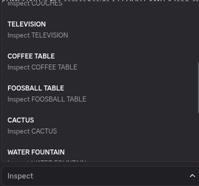

Let's see, how about we have a look at the `COFFEE TABLE`? Let's click on it.

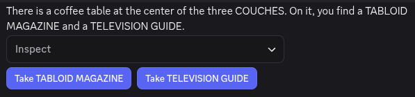

Not only do we know how to inspect things using a command, we can also just click on them! Bet that makes inspecting
a heck of a lot faster doesn't it?

## Picking Items Up

Did you notice that there aren't just furniture around the room, but also things around we can take?
For instance, the coffee table that we inspected has a `TABLOID MAGAZINE` and a `TELEVISION GUIDE` on it.

### The *Take* Command

> [!TIP]
> If there are multiple items with the same name in a room. You can specify which one by using the container it is from.
> For instance, if there are many spoons in a dining room, we can take only the spoon in front of us:
> ```
> .take spoon from table 4
> ```

To take something, you use the [*take* command](../reference/commands/player_commands.md#take). The take command allows
you to take something from the room and put it in an open inventory slot. Keep in mind that we
**must have a free hand** to take something, but since we're not carrying anything in our hands right now, we can take
anything we want.

To use the *take* command we send `.take` followed with the item we want to take. Let's take the `TABLOID MAGAZINE`
from the coffee table.

```txt
.take tabloid magazine
```

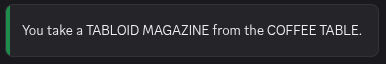

Nice, we now have a tabloid magazine in our possession. Wonder what kind of gossip it has? Turns out that we can also
*inspect* the items in our hand!

> [!TIP]
> If an item in a room has the same name as an item in your inventory, you can *inspect*  your item
> by putting `my` before it.
> For instance, if there are a bunch of sandwiches on the counter and you wish to *inspect* the one you're holding:
> ```txt
> .inspect my sandwich
> ```

```txt
.x tabloid magazine
```

<!--TODO: Get a screenshot of the updated version-->

#### Taking with Interactables

Just like with *inspecting*, we can take items from around the room with interactables. Let's inspect the coffee table
again.

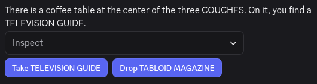

We have the `TABLOID MAGAZINE` in one hand, so our other hand is free, so if we press the `Take TELEVISION GUIDE`
button, we can take that too!


Now that we have the television guide, we can find the airing times for any show we want! Although... who even uses
TV guides these days? Or even watches live TV?

## Your Inventory and You

After raiding the coffee table, our hands are now full with reading material. Since we can't go around all day holding
those, how do we put things in pocket (or bag)? This is where your **inventory** comes in. Each player has an
inventory where they can put the items they are carrying. Your inventory also includes the clothes that you are
wearing.

### The *Inventory* Command

To look at your inventory, you use the [*inventory* command](../reference/commands/player_commands.md#inventory).
The inventory command lists everything that we have equipped and also items that we have ***stashed***.

Let's see what we are carrying with us by sending the `.inventory` command.

```txt
.inventory
```

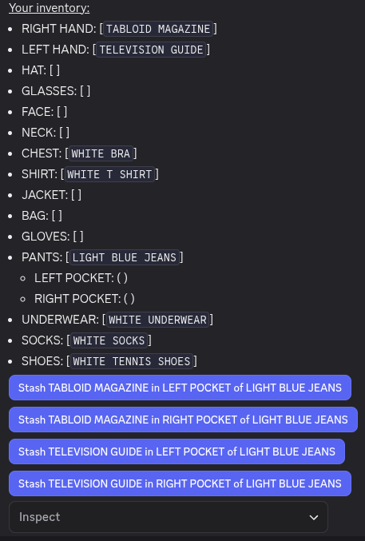

> [!IMPORTANT]
> Remember, we ***equip*** items in equipment slots and ***stash*** items in inventory slots.

Nice! We can see that we're carrying the magazine and the TV guide in each of our hands. We also see that we have a
number of **equipment slots** and **inventory slots**.[^1]

Inventory entries with square brackets `[]` are equipment slots whereas those with round brackets `()` are inventory
slots.

For instance, we have a `BAG` equipment slot with nothing `[]` equipped, whereas our `RIGHT HAND` and `LEFT HAND` have
a `[TABLOID MAGAZINE]` and a `[TELEVISION GUIDE]` equipped respectively.

Pieces of equipment can have inventory slots that we can *stash* items into. For instance, our `PANTS` have two
inventory slots: `LEFT POCKET` and `RIGHT POCKET`.

### The *Stash* Command

Now let's say we want to take the magazine with us to read later. We can do this by *stashing* it in one of our
inventory slots.

The [*stash* command](../reference/commands/player_commands.md#stash) allows you to stash an item in one of your hands
to one of your inventory slots. To use the *stash* command, you send `.stash` followed by an item in your hands then
the inventory slot you want to stash it in.

Let's *stash* our magazine in our left pocket.

```txt
.stash tabloid magazine in left pocket of light blue jeans
```


If we check our inventory again, we can see that the magazine has indeed been stashed in our left pocket.

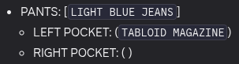

#### Stashing with Interactables

Using the *stash* command can get tedious, given the length of the arguments. That's why you can also *stash* with
interactables!

If we have a look at our inventory again, we can see that there are buttons that let us *stash* items with a single
click.

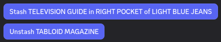

Let's try stashing our TV guide in our right pocket this time with the `STASH TELEVISION GUIDE in RIGHT POCKET of LIGHT
BLUE JEANS` button.

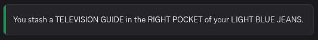

Nice! We put that guide in our pocket without needing to type the full command.

## Getting Rid of Stuff

It's all well and good that we can put stuff in our inventory, but how can we get rid of it? It would be pretty
rude to just take the magazine and the guide from the common room right? So let's try to put them back where they
were on the coffee table.

First, we have to ***unstash*** them from our inventory and return it to our hands before we can ***drop*** them.

### The *Unstash* Command

> [!NOTE]
> While you **can** specify the container to unstash an item from (i.e. `.unstash television guide from right pocket of
light blue jeans`), this is only necessary when you have multiple of the same item in your inventory.

The [*unstash* command](../reference/commands/player_commands.md#unstash) lets you remove an item from one of your
inventory slots and place it in your hand. To use it, send `.unstash` followed by the item you want to *unstash*.

Let's try *unstashing* the TV guide.

```txt
.unstash television guide
```


If we look at our inventory, we can see that the TV guide has been returned to one of our hands.

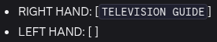

#### Unstashing with Interactables

As with the *stash* command, we can unstash items by clicking on the corresponding button in our inventory.
We will also *unstash* our `TABLOID MAGAZINE`, but we will leave that out of the guide for brevity.

### The *Drop* Command

> [!IMPORTANT]
> If you use the *drop* command without specifying where, you'll end up dropping it on the floor!

Now that we have our TV guide and tabloid magazine back in our hands, we can put it back on the coffee table with the
[*drop* command](../reference/commands/player_commands.md#drop). To use the *drop* command, type the `.drop` command
followed by where you want to drop the item.

Let's try *dropping* the TV guide on on the coffee table.

```txt
.drop television guide on coffee table
```


Now all we have to do is to put the magazine back as well.

#### Dropping with Interactables

As with picking up items, we can use interactables to drop them as well. To do this, we first have to *inspect* the
place we want to *drop* the item on.

```txt
.x coffee table
```

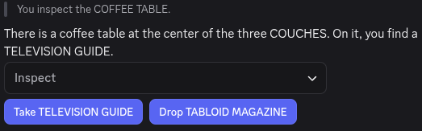

If we click on the `Drop TABLOID MAGAZINE` button, we can *drop* that as well.


Now everything is back where it should be!

## Using Items

While just looking at and taking items can be interesting, you can ***use*** some items as well!

Not all items can be *used*, but *using* items is very important! For instance, to not starve, you have to
eat regularly. To do that, you must *eat* (*use*) food. Alter Ego games often contain puzzles, some of which might
involve *using* certain items such as a remote control. Some doors might also be unlocked by pressing (*using*) a button
on the wall.

Not only can you *use* items that are in your inventory, you can *use* items around the game world too regardless of if
they can be picked up. So go around, explore, and try and *use* stuff!

### The *Use* Command

To *use* an item, you use the [*use* command](../reference/commands/player_commands.md#use). As there are many ways to
*use* something, this is a command that has many aliases. Some of them include `.eat`, `.drink`, and `.activate`.
It usually doesn't matter which one you use,[^2] so don't worry about which alias to use!

Have you ever been in a situation where you find yourself holding a bass guitar? Well if you do, perhaps your first
instinct is to *use* it. To *use* an item, type the `.use` command followed by the item or *fixture* (something in a
room that can't be moved by a player e.g. a piano) you want to *use*.

Let's try and *use* our `BASS GUITAR` and see what happens.

```txt
.use BASS GUITAR
```

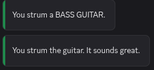

Now we're ready to jam!

#### Using with Interactables

We can also use interactables to *use* things. Let's have a look at our inventory.

```txt
.i
```

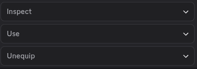

As we have the `BASS GUITAR` in our hands, we see that a `Use` dropdown menu[^3] has appeared at the bottom of our
inventory!

Let's open that dropdown by clicking on it.

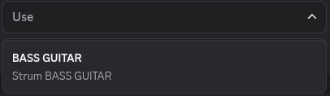

Looks like the only thing we can use is our `BASS GUITAR`. Let's click on it.


Nice! Now we're really making a name for ourselves in history or rock n' roll!

[^1]: Inventory slots can be configured by your moderator, so don't worry if this inventory looks different from yours!
[^2]: This is true except for a few edge cases. For instance, it's not possible to `.lock` or `.unlock` a sandwich.
In general, if the sentence makes sense, it should be possible!
[^3]: Wondering why it's a dropdown when you can only hold up to two items? Sometimes using an item can have dangerous,
irreversible effects. You wouldn't want to poison yourself by using a `CYANIDE PILL` because you accidentally pressed
a button. Since it's a dropdown, you have to perform two clicks or taps to use it, making it less likely that you'll
use something by accident.
