<!--
SPDX-FileCopyrightText: 2026 Amy Poon <amy@amypoon.me>
SPDX-FileCopyrightText: 2026 Ms. VBLANK <alteregomolly@pm.me>

SPDX-License-Identifier: CC-BY-SA-4.0
-->

# Moving Around

Using Alter Ego, you can explore detailed game worlds and role play in them. To do that, we must be able to
move around the world. Earlier, we briefly touched on moving to another room with interactables, but this chapter will
go into the details about how to move around like a champ.

## The *Move* Command

The [*move* command](../reference/commands/player_commands.md#move) lets you move between rooms in Alter Ego.
To use it, type the `.move` command followed by the ***exit*** you want to go to.

Before we can go somewhere, we need to find out where we can go. Let's do that by inspecting the room.

```txt
.x room
```

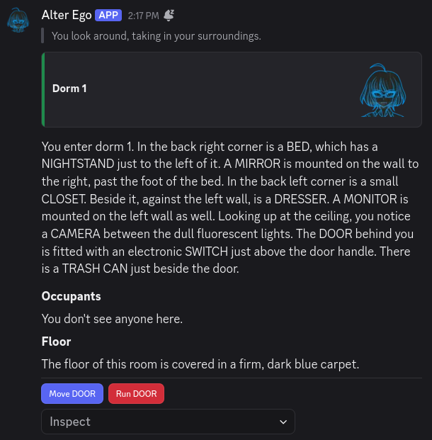

The interactables give it away, but it seems like the only exit in this room is the `DOOR`. Without interactables,
though, it should usually be pretty clear what is an _exit_, and what is a _fixture_. _Exits_ will usually
(but not always) have a word such as `DOOR`, `HALL`, or `PATH` in their name. In some cases, they might even be a
proper noun. There can sometimes be _fixtures_ with the same name as an _exit_ in a room (meaning you can inspect them),
but this is rarely the case.

In any case, let's try using the _move_ command.

```txt
.move door
```

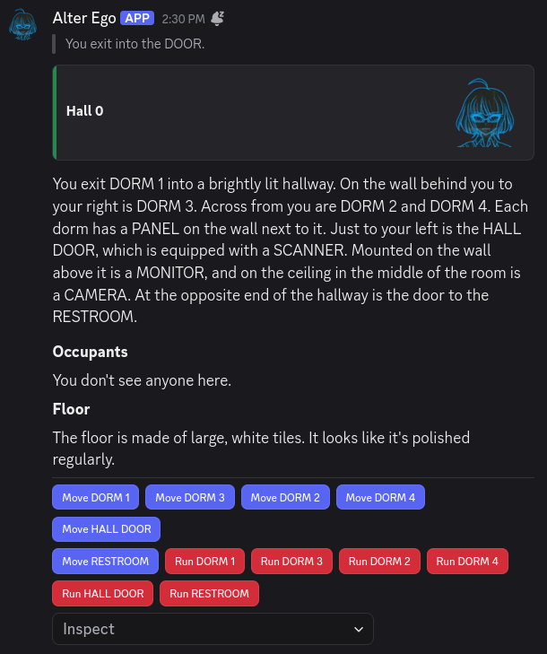

We've moved to a new room! If you navigate over from your DMs with Alter Ego to the game's server, you'll find that
the single _room_ channel you have access to has changed.

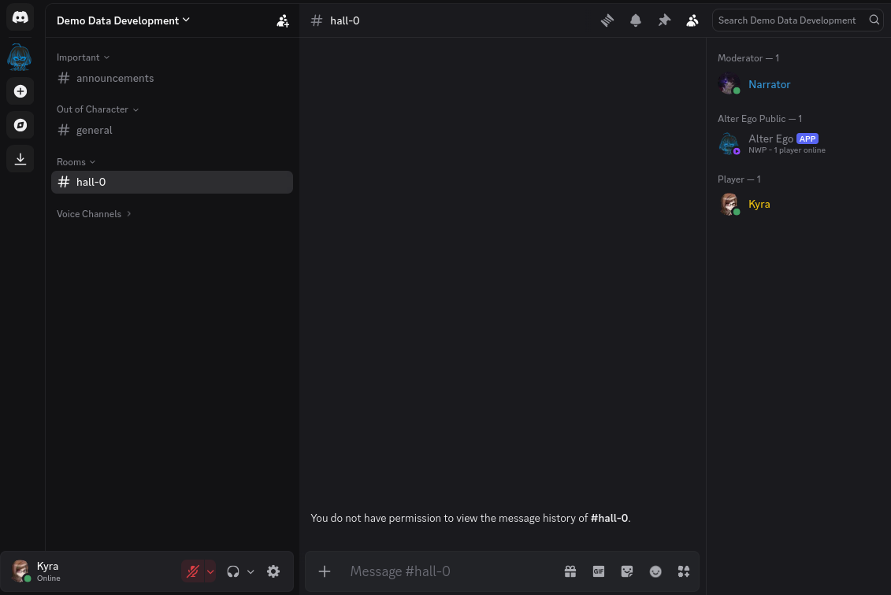

The occupants list said `You don't see anyone here.`, and sure enough, on the member list in the channel for this room,
it's just us, Alter Ego, and the moderator. We also don't have permission to view the message history in this channel;
this is normal. If we did, we would be able to see everything that happened in this room before we got here, which
could really break our immersion!

> [!TIP]
> When you enter a new room, the _first_ thing you should do is navigate to the server and open the channel for it. That
> way, the slice of message history that you have access to will begin immediately when you enter the room. If you wait
> until later, you might not be able to see that someone has been trying to talk to you, or that someone was doing
> something suspicious when you entered.

If you head back to your DMs with Alter Ego, you'll notice that the description of `Hall 0` specifically described the
room from the perspective of someone entering from `DORM 1`. Every exit in a room can have a unique description for
when a player enters from it. If someone had entered from `DORM 2`, `DORM 3`, `DORM 4`, or any of the other exits in
this room, they would have been sent a slightly different perspective of the room!

> [!NOTE]
> When you _inspect_ a room by sending `.inspect room`, you will be sent the description of the room from the
> perspective of the first exit it has. This may not be the exit you originally entered from, so the perspective can
> vary slightly. Try your best to visualize the layout of the room so you don't get disoriented!

Before we proceed to the next room, let's go back to our dorm for a moment. We'll use the shortest alias for the _move_
command this time:

```txt
.m dorm 1
```

Now that we're back in `Dorm 1`, we can move back to the hall in a different way. We know from experience that the
`DOOR` in `Dorm 1` leads to a room named `Hall 0`. If we know the name of a room that's connected to the room we're
currently in, we can _also_ use its name, instead of the name of the exit leading to it. So, for example, if we type:

```txt
.m hall 0
```


It worked! If you know the name of a room, you can always use that in your move command. This can make it _much_ easier
to get around, especially if the game has a lot of exits with vague names like `DOOR 1`, `DOOR 2`, and so on.

There's one last thing to keep in mind. When you want to move to another room, you can only move to ones that are
directly connected to the room you're currently in by at least one exit. Even if you know the name of a room, you won't
be able to move there if it isn't connected to your current room. If you have the
[Free Movement role](../reference/settings.md#free_movement_role), though, you can move to any room you want.

### Moving with Interactables

Now that we are in a different room, let's try using interactables. See those blue buttons below the room description?
Let's click on `Move HALL DOOR`.

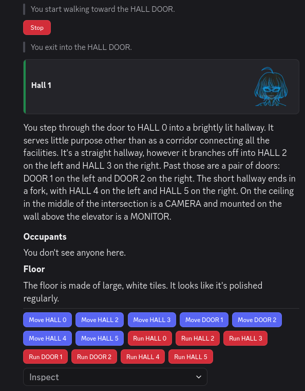

How convenient! We can move to different rooms without having to type a single command! The only downside is that we
have to remember which exit leads to which room, as the buttons use the names of the exits, instead of the names of the
rooms they lead to.

## The _Run_ Command

Did you notice how when we pressed the `Move HALL DOOR` button, there was a message that said
`You start walking toward the HALL DOOR.`? This is because it takes time to move from room to room. If a room only has
one exit (like the room we started off in, `Dorm 1`), it will take no time at all, but for rooms with multiple exits,
the amount of time it takes to move from one room to another can vary.

While it may seem simple at first glance, when you move in Alter Ego, you are actually moving around in a 3D space. How
this works is quite complicated, but most of it is hidden from view; if you want to learn all of the technical details,
see [this section](../reference/data_structures/player.md#speed).

However, to give a brief overview, every _exit_ has a set of _coordinates_ in 3D space, and when you enter a room, your
_position_ matches the _coordinates_ of the _exit_ you entered from. When you move to another _exit_, Alter Ego
calculates the amount of time it will take for you to move from your current _position_ to that _exit's_ _coordinates_
based on your character's _speed stat_. Once that amount of time has elapsed, you will finally move to the
desired _exit_.

So, what if the exit you want to move to is quite far from your current position? You might be in a hurry; maybe you're
short on time, or maybe someone is chasing you around with a weapon. This is where the
[_run_ command](../reference/commands/player_commands.md#run) comes in handy.

The _run_ command works exactly the same as the _move_ command, with a few key differences. Let's try it out.

```txt
.run hall 5
```

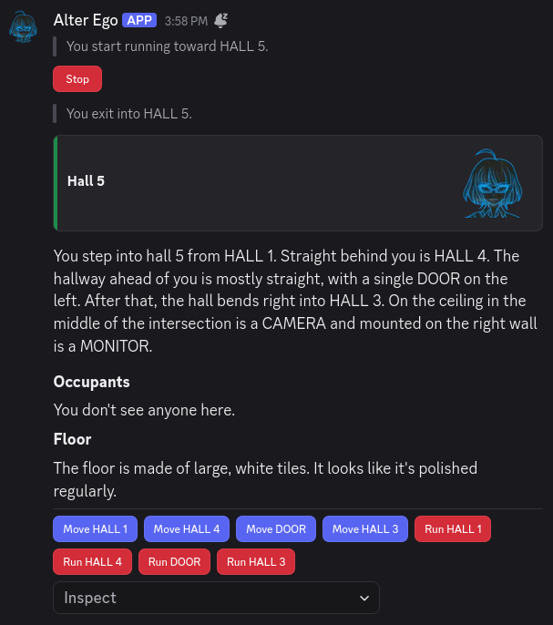

Nice! We got here much faster than if we had used the regular _move_ command. Alter Ego even specified
`You start running toward HALL 5.` instead of the usual message.

Now that we've used the _run_ command, what are the differences between it and the _move_ command?

1. You will move at double your usual speed, and
2. You will consume three times as much **stamina** while moving.

_Stamina_ is another one of your character's _stats_. It determines how long you can move around continuously before
getting tired. Whenever you are moving, you are consuming _stamina_; whenever you are not moving, your _stamina_ is
recovering. If you run out of _stamina_, you will become **weary**, and you will be completely unable to move for a set
period of time while your stamina recovers.

So, as you can see, while the _run_ command is useful for getting around quickly, it should be used sparingly. The last
thing you want is to become completely immobilized when you're trying to get somewhere; that would be totally
counterproductive.

How do you know if you're getting low on _stamina?_ Alter Ego will give you a warning when you've depleted half of
it---if you see this, that's your sign to take a break soon!

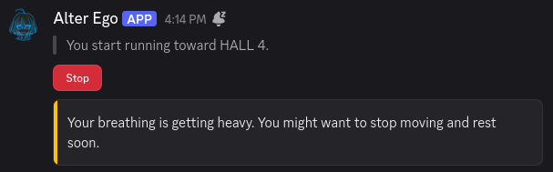

### Running with Interactables

As you've no doubt already noticed, you can also run using interactables. Continuing from `Hall 5`, let's press the red
button labeled `Run HALL 3`.

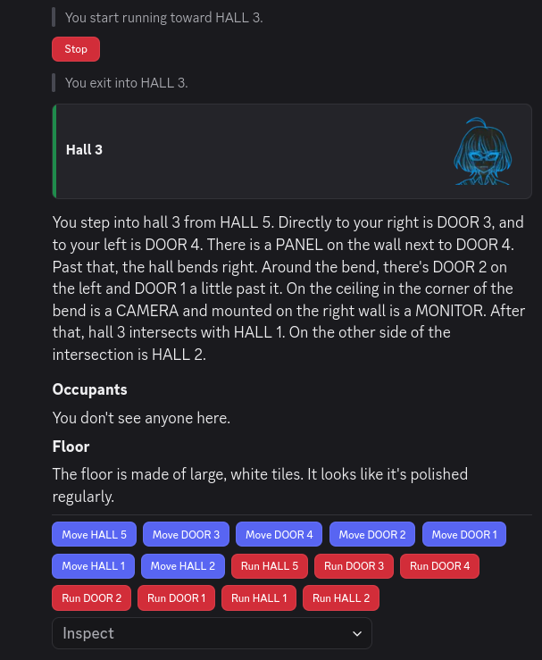

Nice! Being able to run with just the click of a button will definitely help us get around faster.

## Stopping

By now, you've probably noticed that when you start moving or running to another room, Alter Ego will send an
interactable that says `Stop`. If you are currently moving, you can cancel your movement by pressing this button, or by
using the _stop_ command, like so:

```txt
.stop
```

Whichever method you choose, Alter Ego will confirm that you've stopped moving.


One thing to keep in mind that when you're in the process of moving, your _position_ is constantly being updated as you
get closer to your destination. When you _stop_, your latest _position_ will be preserved, and that will be your new
_starting position_ if you decide to move again.

## Locked Doors

Since we're still in `Hall 3`, let's try moving to `DOOR 4`.

```txt
.m door 4
```

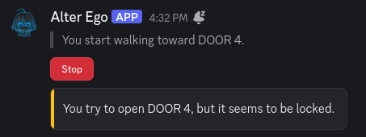

Shoot! It's locked! We can't go inside. According to the room description, there is a `PANEL` on the wall next to
`DOOR 4`, so let's try _inspecting_ it.

```txt
.x panel
```

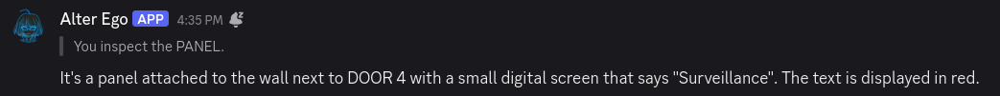

Since there is a _fixture_ mentioned next to `DOOR 4`, that means there is probably a _puzzle_ attached to it that might
be able to unlock the door. Let's try _using_ the `PANEL` and see what happens.

```txt
.use panel
```

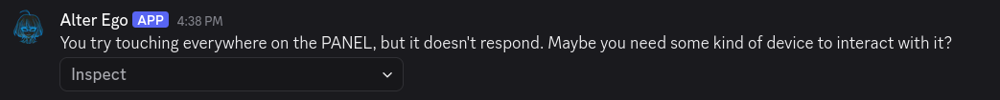

There is a _puzzle!_ This means we might be able to unlock `DOOR 4`, but we probably need a key of some sort. If we
don't have the key, though, we'll just have to try again later. It's not worth wasting our time trying to open it if
we don't have what we need.

## Queuing Movement

In addition to being able to enter the names of rooms, the _move_ and _run_ commands offer one additional advantage over
interactables: the ability to queue future movements. If, after writing the name of an exit or room in your _move_ or
_run_ command, you enter the greater-than character (`>`), you can then enter the name of _another_ exit or room in the
destination to move to. Let's give it a try.

```txt
.m hall 5 > hall 4
```

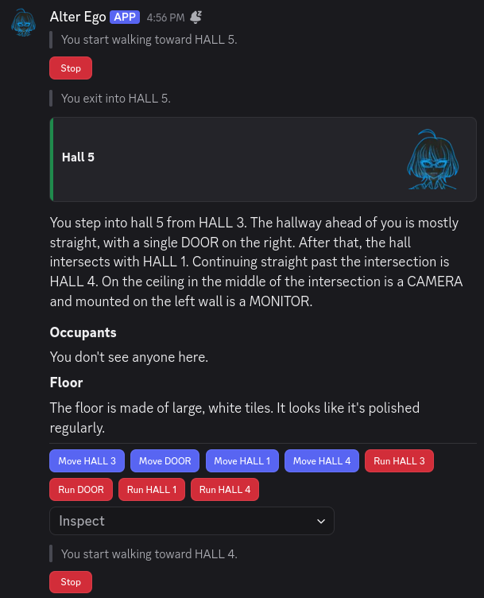

Wow! Immediately after entering `Hall 5`, we started moving to `Hall 4` without having to do a thing. Of course, we had
to _know_ that you could get to `Hall 4` from `Hall 5`, so this isn't something we could have done if we didn't remember
it. If we had tried to move to `Hall 0` from `Hall 5` instead, Alter Ego would have told us there was no such
destination once we arrived in `Hall 5`. So, queuing your movements is something you can only do effectively if you are
already very familiar with the map. Once you are, though, you can get around much more efficiently.

> [!IMPORTANT]
> When queuing your movements, Alter Ego will only parse the next destination in the queue _after_ you finish moving to
> the previous one. If one of the destinations in your queue is invalid, or the exit is locked, you won't find out until
> you've progressed up to that point in the queue.

You can queue as many movements as you like, and you can even mix together exit names and room names. Movement queues
are very flexible. Let's try a roundabout way to get to the `Kitchen` from `Hall 4`:

```txt
.m hall 5 > hall 1 > hall 2 > kitchen
```

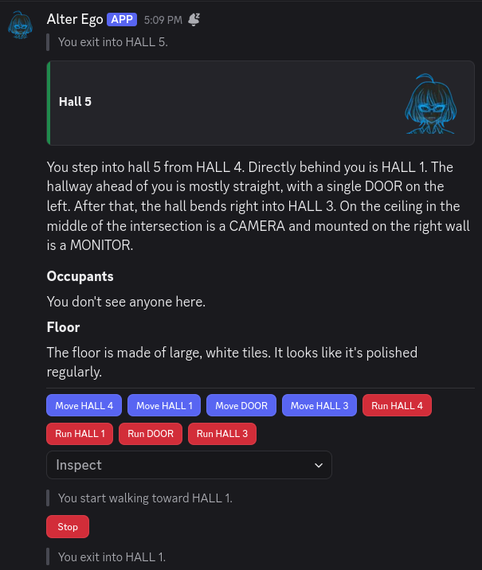

Now that our movements are queued, now's a good time to take a break. Maybe we can get up to use the restroom, or switch
to another tab to respond to the friend that sent us a DM.

When we come back, we've arrived in the `Kitchen`! Hooray!

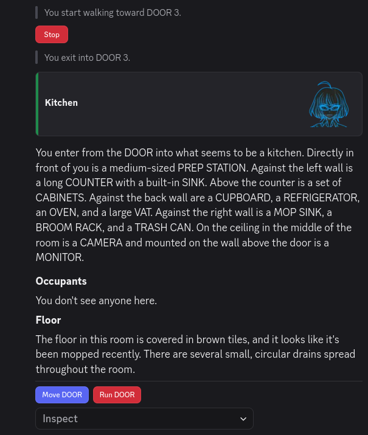

Let's step back outside for a moment. Have you ever wanted to run around in circles? Well, Alter Ego allows you to do
just that. If you find a set of rooms that you can travel around in a loop, you can queue your movements like so:

```txt
.run hall 4 > hall 5 > hall 3 > hall 2 > hall 4 > hall 5 > hall 3 > hall 2 > hall 4 > hall 5 > hall 3 > hall 2
```

And then, you'll run around the loop _three times_. Just be sure to keep an eye on your stamina!

If you decide to _stop_ while you're moving through your queue---whether by using the _stop_ command or by pressing the
`Stop` interactable---not only will you immediately stop moving, but your movement queue will be cleared.
