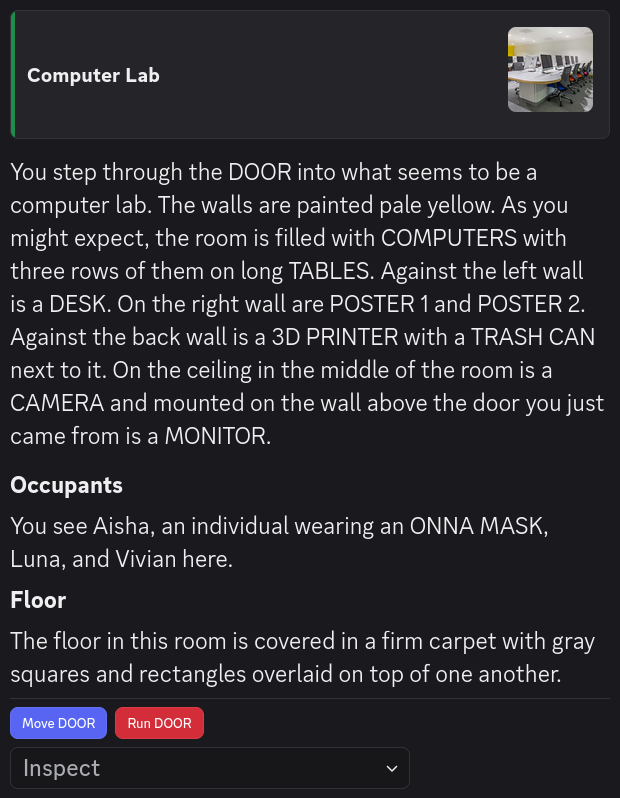

# Exit

An **Exit** is a data structure used by Alter Ego. It represents an exit in a [Room](room.md).

## Attributes

Exits are the internal data structure linking Rooms to one another. As such, most of their attributes serve this
purpose. Note that if an attribute is _internal_, that means it only exists within
the [Exit class](https://github.com/MolSnoo/Alter-Ego/blob/master/Data/Exit.ts). Internal attributes will be given in
the "Class attribute" bullet point, preceded by their data type. If an attribute is _external_, it only exists on the
spreadsheet. External attributes will be given in the "Spreadsheet label" bullet point.

### Name

- Spreadsheet label: **Exit Name**
- Class attribute: [String](https://developer.mozilla.org/en-US/docs/Web/JavaScript/Reference/Global_Objects/String)
  `this.name`

This is the name of the Exit. All letters should be capitalized, and spaces are allowed. For clarity's sake, it should
usually be mentioned in all descriptions of the Room it belongs to, unless it is supposed to be hidden.

### Phrase

- Spreadsheet label: **Exit Phrase**
- Class attribute: [String](https://developer.mozilla.org/en-US/docs/Web/JavaScript/Reference/Global_Objects/String)
  `this.phrase`

This is a natural-sounding phrase to use to refer to the Exit in [Narrations](narration.md). This is used when a Player
begins moving toward the Exit, as well as when they exit into or enter from it.

In general, if the name of an Exit ends with a number or is a proper noun, this should be manually set to just be the
name of the Exit. Otherwise, Narrations such as "\[Player display name] exits into the DOOR 1." or
"\[Player display name] enters from the STOKE HALL." will be sent, which may sound unnatural.

This only contains what is entered on the sheet. To get the the actual phrase that will be used in Narrations,
use the [`getNamePhrase` method](#getnamephrase).

### Tags

- Spreadsheet label: **Exit Tags**
- Class attribute: [Set](https://developer.mozilla.org/en-US/docs/Web/JavaScript/Reference/Global_Objects/Set)<[String](https://developer.mozilla.org/en-US/docs/Web/JavaScript/Reference/Global_Objects/String)>
  `this.tags`

This is a comma-separated list of keywords or phrases assigned to the Exit that give it special behavior. This is not
to be confused with [Room tags](room.md#tags).

Currently, the only tag with programmed behavior is `not knockable`. If an Exit has this tag,
a Player cannot [knock](action.md#knock-action) on it.

More Exit tags will be added in future releases.

### Position

- Class attribute: [object](https://developer.mozilla.org/en-US/docs/Web/JavaScript/Reference/Global_Objects/Object)
  `this.pos`

This is an internal attribute whose properties are the X, Y, and Z coordinates of the Exit.
It has the following structure:
```ts
interface Pos {
    x: number;
    y: number;
    z: number;
}
```

For more information, see the article on [Maps](../../moderator_guide/mapmaking.md).

#### X

- Spreadsheet label: **X**
- Class attribute: [Number](https://developer.mozilla.org/en-US/docs/Web/JavaScript/Reference/Global_Objects/Number)
  `this.pos.x`

This is the X coordinate of the Exit. This corresponds with the X-axis on a 3D grid.

#### Y

- Spreadsheet label: **Y**
- Class attribute: [Number](https://developer.mozilla.org/en-US/docs/Web/JavaScript/Reference/Global_Objects/Number)
  `this.pos.y`

This is the Y coordinate of the Exit. This corresponds with the Y-axis on a 3D grid, which represents vertical height.

#### Z

- Spreadsheet label: **Z**
- Class attribute: [Number](https://developer.mozilla.org/en-US/docs/Web/JavaScript/Reference/Global_Objects/Number)
  `this.pos.z`

This is the Z coordinate of the Exit. This corresponds with the Z-axis on a 3D grid.

### Unlocked

- Spreadsheet label: **Unlocked?**
- Class attribute: [Boolean](https://developer.mozilla.org/en-US/docs/Web/JavaScript/Reference/Global_Objects/Boolean)
  `this.unlocked`

This indicates whether the Exit is unlocked or not. If this is `true`, then [Players](player.md) can travel through
this Exit. If it is `false`, then the Player will simply be told that the Exit is locked.

### Destination Display Name

- Spreadsheet label: **Leads To Room**
- Class attribute: [String](https://developer.mozilla.org/en-US/docs/Web/JavaScript/Reference/Global_Objects/String)
  `this.destDisplayName`

This is the display name of the Room the Exit leads to, as entered on the spreadsheet. This must match the Room's
display name on the spreadsheet exactly.

### Destination

- Class attribute: [Room](room.md) `this.dest`

This internal attribute contains a reference to the actual Room object that the Exit leads to. When a Player travels
through this Exit, their permission to view the channel of their current Room will be revoked and they will then be
given permission to view the channel associated with the Exit's destination.

### Link

- Spreadsheet label: **From Exit**
- Class attribute: [String](https://developer.mozilla.org/en-US/docs/Web/JavaScript/Reference/Global_Objects/String)
  `this.link`

This is the name of the Exit in the destination Room that this Exit leads to. That Exit must also have this Exit as its
link. That is, Exits must link back to one another in both directions. For example, in a set of two Rooms, each with
one Exit only, their Exit tables must look like this:

| Room Display Name | Exit Name | Leads To Room | From Exit |
|-------------------|-----------|---------------|-----------|
| Room 1            | DOOR      | Room 2        | EXIT      |
| Room 2            | EXIT      | Room 1        | DOOR      |

### Description

- Spreadsheet label: **Description When Entering From This Exit**
- Class attribute: [Description](description.md) `this.description`

This is the description of the Room coming from this Exit. That is, when a Player enters a Room from this Exit, they
will receive a parsed version of this string. The Player will not be sent the Exit's description by itself. Instead,
they will be sent a message comprised of
[Discord Components](https://docs.discord.com/developers/components/reference) containing:

- The display name of the Room.
- The description of the Exit they entered from.
- The Room's occupants, excluding the Player themself.
- The description of the Room's [default drop Fixture](../settings.md#default_drop_fixture). If the Room
  doesn't have one, "There's nothing of note about the \[name of default drop Fixture]." will be sent instead.
- The Room's icon URL. If the Room does not have one, then the [default Room icon URL](../settings.md#default_room_icon_url)
  will be used instead. If no default Room icon URL is set, then Alter Ego will use the server icon instead. If the
  server icon is not set, then no image will be sent in the Room's display name component.



See the article on [writing descriptions](../../moderator_guide/writing_descriptions.md) for more information.
Note that because this uses its own custom set of Display Components, it is not possible to manually set the
[message display type](../discord.md#display-components) for this Description.

### Row

- Class attribute: [Number](https://developer.mozilla.org/en-US/docs/Web/JavaScript/Reference/Global_Objects/Number)
  `this.row`

This is an internal attribute, but it can also be found on the spreadsheet. This is the row number of this Exit in a
Room.

## Methods

Exits have a number of functions that can be useful to moderators. This is not an exhaustive list of publicly
accessible methods; only ones that are likely to be useful when writing [Flag value scripts](flag.md#value-script), or
[`if`](../../moderator_guide/writing_descriptions.md#if) and [`var`](../../moderator_guide/writing_descriptions.md#var)
tags in descriptions.


### getNamePhrase

```ts
this.getNamePhrase();
```

- Purpose: Gets a phrase to refer to the exit in narrations.
- Returns: [String](https://developer.mozilla.org/en-US/docs/Web/JavaScript/Reference/Global_Objects/String) ---
  If the exit has a phrase assigned to it, returns that. If not, returns the exit's name if it ends with a number,
  or `the ${this.name}` otherwise.
- Parameters: None

### getDoorPhrase

```ts
this.getDoorPhrase();
```

- Purpose: Gets a phrase to refer to the door in narrations.
- Returns: [String](https://developer.mozilla.org/en-US/docs/Web/JavaScript/Reference/Global_Objects/String) ---
  If the exit's name phrase ends with a number, includes the word "DOOR", or has the tag `not knockable`, returns the
  exit's name phrase by itself. Otherwise, returns `the door to ${this.getNamePhrase()}`.
- Parameters: None

### hasTag

```ts
this.hasTag(tag);
```

- Purpose: Returns true if the exit has the given tag.
- Returns: [Boolean](https://developer.mozilla.org/en-US/docs/Web/JavaScript/Reference/Global_Objects/Boolean)
- Parameters:
  - [String](https://developer.mozilla.org/en-US/docs/Web/JavaScript/Reference/Global_Objects/String) `tag`
