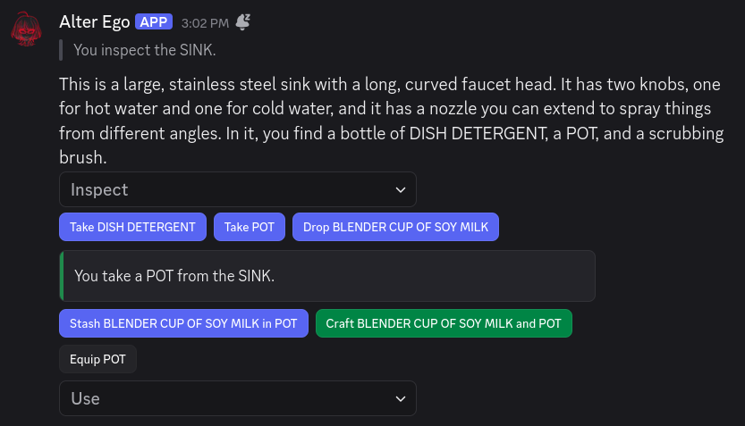
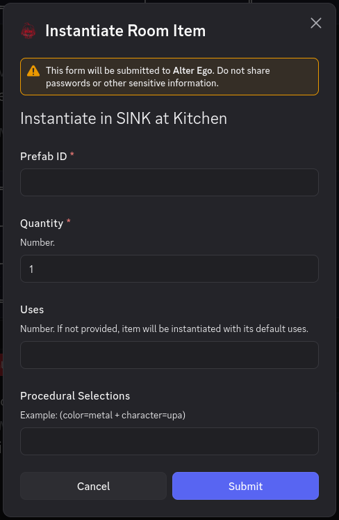

# Interactables

The primary way of interacting with Alter Ego is via [commands](commands/index.md). However, **Interactables** provide
an alternative way of doing so that requires less input. Their main purpose is to provide shortcuts to many of
the most commonly-performed [Actions](data_structures/action.md) in Alter Ego.

Interactables make use of Discord's Interactive Components:
[Action Rows](https://discordjs.guide/legacy/interactive-components/action-rows). Alter Ego also has limited support
for [Modals](https://discordjs.guide/legacy/interactions/modals).

This article will provide a general overview of what Interactables are, how they're created, and how they're used
to facilitate gameplay.

> [!NOTE]
> "Interactable" is a term referring to Alter Ego's implementation of Discord's Message Components that emit
> [Interactions](https://docs.discord.com/developers/interactions/overview).
> The term "Interactable" is not used by Discord.

## The Interactable Class

Under the hood, all Interactables derive from an
[abstract base class](https://en.wikipedia.org/wiki/Class_(programming)#Abstract) named Interactable. It has the
following attributes:

### Type

- Class attribute: [Enum (number)](https://developer.mozilla.org/en-US/docs/Web/JavaScript/Reference/Global_Objects/Number)
  `this.type`

This is the type of Interactable being created. It can be one of the following:

- `BUTTON`
- `STRING_SELECT_MENU`
- `STRING_SELECT_MENU_OPTION`
- `MODAL`
- `TEXT_INPUT`

### Custom ID

- Class attribute: [String](https://developer.mozilla.org/en-US/docs/Web/JavaScript/Reference/Global_Objects/String)
  `this.customId`

This is an ID unique to the Interactable within a single message. Its purpose is to allow the
[interaction handler](#interaction-handler) to identify which Interactable was used, and to encode the information
it needs to execute the right behavior for the Interactable. For more information, see Discord's documentation on the
[`custom_id` field](https://docs.discord.com/developers/components/reference#anatomy-of-a-component-custom-id).

### Priority

- Class attribute: [Number](https://developer.mozilla.org/en-US/docs/Web/JavaScript/Reference/Global_Objects/Number)
  `this.priority`

This is a number which determines how high up an Interactable will appear in a list of Action Rows. The lower this
value, the higher priority the Interactable has.

### Respond With Modal

- Class attribute: [Boolean](https://developer.mozilla.org/en-US/docs/Web/JavaScript/Reference/Global_Objects/Boolean)
  `this.respondWithModal`

This Boolean value indicates whether this Interactable will respond with a Modal Interactable when it is selected.

## Action Directive

The **Action Directive** is the cornerstone of Alter Ego's system of Interactables. It allows Discord's Components to
encode much more information than they were originally intended to, thus simplifying the process of performing Actions.

An Action Directive is constructed with a specific [type of Action](data_structures/action.md#types-of-actions),
a [Player](data_structures/player.md) to perform it, and the arguments that will be needed to perform it.

After an Action Directive is constructed, its custom ID is generated by encoding its arguments, and the ID of the user
it is being created for, in a [hash function](https://en.wikipedia.org/wiki/Cryptographic_hash_function). This allows
a unique custom ID to be generated for each Interactable that encodes all of the information required to perform an
Action for a given user without exceeding Discord's custom ID character limit of 100.

Once its custom ID has been generated, the Action Directive serves as a _directive_ to perform an _Action_ with _those_
specific parameters, for _that_ specific user.

## Interactable Manager

Alter Ego has an Interactable Manager class that allows it to create and manage Interactables. An overview of how it
works will be provided here.

### Create Action Interactables Methods

The Interactable Manager has a number of public methods to create Interactables to perform Actions for a given Player
and user. Which Actions have support for Interactables is detailed on the [Action article](data_structures/action.md).

All of these methods can generate multiple Interactables. Most of them can return either an array of
[Buttons](https://docs.discord.com/developers/components/reference#button) or a
[String Select Menu](https://docs.discord.com/developers/components/reference#string-select) based on how many
Interactables were generated. For these methods, String Select Menus are typically the secondary choice, in case too
many Interactables are to be generated, or if a more detailed description needs to be shown. However, some methods
can only generate Buttons, and some can only generate String Select Menus.

Most of these public methods perform some validation to determine which Interactables to create. For example, if a
Player's [held item](data_structures/equipment_slot.md) is too large to fit in a given
[Inventory Slot](data_structures/inventory_slot.md), the method to create
[Stash Action](data_structures/action.md#stash-action) Interactables will not generate an Interactable to stash that
specific Inventory Item in that specific Inventory Slot. This built-in validation makes it relatively easy to insert
Interactables in messages where they might be desired.

A small number of these methods can only generate a Modal---these are a last resort, in case it is impossible to
perform an Action using only a Button or a String Select Menu, and they are only ever generated as a response
to an Interaction with a different Interactable. Modals are reserved for open-ended Interactions
where the user can enter any text they desire, like so:

When an Interactable is created, what's really happening is that an Action Directive is created for the Action to be
performed. The arguments required to perform the Action are converted into strings that can later be used to
[find](data_structures/game.md#entity-finder) the Game Entities needed to perform the Action, and an Action Directive
is created with those arguments. Then, for each Action Directive that was created, an Interactable is created with that
Action Directive's custom ID and the Action Directive itself, and the array of all created Interactables is returned,
so that they can be inserted into a message to be sent to the user.

### The Interactable Cache

When an Interactable is created, it is added to the Interactable Manager's Interactable cache. This is a
[Collection](https://discord.js.org/docs/packages/discord.js/14.25.1/Collection:Class) where the key is the
Interactable's custom ID, and the value is the Interactable itself.

The cache has a size limit of 500. If the size of the cache exceeds this limit, the oldest Interactable is removed to
make space for the new one.

If an Interactable with the same custom ID as the one being added is already in the cache, it is deleted and replaced
with the new one. Since Interactables can only have the same custom ID if they have the exact same arguments, no
information is lost when this occurs; this effectively "refreshes" its lifetime, making it the most recently-added
Interactable.

### The Interactable Message Cache

In addition to a cache of Interactables, the Interactable Manager also has a cache of Interactable messages: messages
which contain Interactable Components. This is also a Collection. When a message with Interactables is sent, the ID of
the channel the message was sent to, as well as its message ID, are used as the key, and added to the message cache.
The value of each entry is an array of the custom IDs of all Interactables in the message.

This cache has two limits. The first is that it can only contain up to 50 messages. If the size of the cache exceeds
this limit, the message containing all of the Interactables is edited to remove its Action Row Components, the message
is removed from the message cache, and the Interactables themselves are removed from the Interactable Cache. The second
limit is that Interactable messages are valid for up to 5 minutes. If 5 minutes have passed since the message was added
to the cache and it hasn't already been removed due to exceeding its size limit, it will be removed the same way as if
the size limit was exceeded.

When an Interactable message is removed from the cache, it is no longer possible to use any of the Interactables that
were sent with the message. Even if Interactables with the same custom IDs still exist in the Interactable cache,
they must be attached to a different message. The message that was originally added to the cache no longer _has_ any
Interactables to interact with.

## Interaction Handler

In addition to the Interactable Manager, Alter Ego also has an Interaction Handler class that allows it to respond to
[Interaction](https://docs.discord.com/developers/interactions/receiving-and-responding) events.

The only Interactions Alter Ego is programmed to respond to are when a user presses a Button, selects an option from a
String Select Menu, or presses the Submit button in a Modal. When one of these events occur, the Interaction Handler
retrieves the user who performed the Interaction. If the user isn't a
[known Moderator](data_structures/game.md#moderators) or [Player](data_structures/player.md), it ignores the
Interaction. If the user is valid, it retrieves the custom ID of the Interaction, and then processes it.

First, the Interaction Handler gets the Interactable corresponding with the custom ID from the Interactable Manager's
Interactable cache. If no such Interactable is found, Alter Ego replies to the Interaction with an error message.

If an Interactable is found, and it has an Action Directive, the corresponding Action is created with the Action
Directive's Player, their [location](data_structures/player.md#location), and the user of the Interaction. If the user
is a Moderator, the Action is considered to have been [forced](data_structures/action.md#forced). Note that an Action
born from an Action Directive will always have an `undefined` [message](data_structures/action.md#message).

After the Action has been created, the Interaction Handler calls the Action's parse and validate Interaction arguments
functions. The purpose of these functions is to take the arguments of the Action Directive and reconstruct the arguments
needed to call the Action's perform function. How these arguments are parsed and validated depends on the Action being
performed, but in general:

1. Parsing the arguments means that the string arguments of the Action Directive are used to find any Game Entities
   that are needed to perform the Action with the [Game Entity Finder](data_structures/game.md#entity-finder).
2. Validating the arguments means ensuring that the Game Entities that were found still actually exist and can be
   interacted with, and that the Player can actually perform the Action---the state of the game may have changed
   significantly between when the Interactables were created and when the Interaction occurred, so the Player may not
   be able to perform it anymore.

If the arguments cannot successfully be parsed, or the parsed arguments are invalid, Alter Ego will reply to the
Interaction with an error message, and no Action will be performed.

However, if the Action Directive's arguments were successfully parsed and validated, the validate function will always
return the arguments needed to call the perform function for the given Action. When this occurs, the Action is
performed with these arguments, and the Interaction is considered complete. If the Action has a
[success message](data_structures/action.md#success-message), Alter Ego will reply to the Interaction with it.
